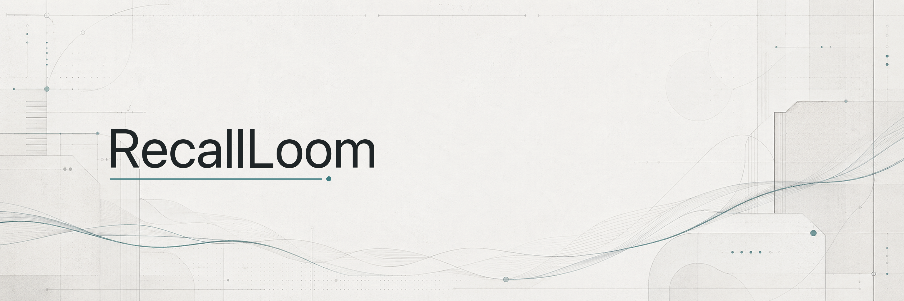
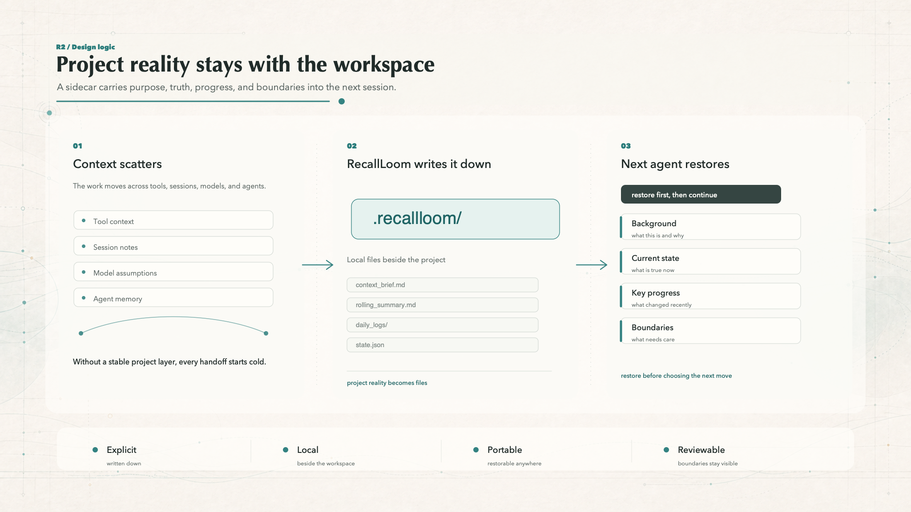
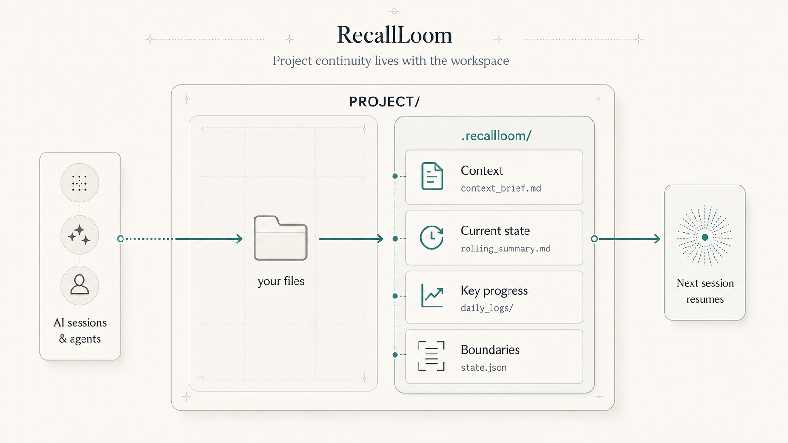

<div align="center">

<h1>🧶 RecallLoom</h1>

**Let the project remember itself.**

**Built for projects that keep moving across agents, sessions, and models.**

[](./skills/recallloom/package-metadata.json)
[](./LICENSE)
[](./skills/recallloom/package-metadata.json)

**English** · [简体中文](./README.zh-CN.md)

</div>

<p align="center">
  
</p>

If every time you switch to a supported coding agent, directory-based tool, or fresh session you spend ten minutes re-explaining the project, what is usually missing is not a smarter model. It is a layer of project continuity that does not disappear.

RecallLoom keeps the project's why, what is true now, recent progress, and next move with the project itself instead of locking them inside one platform's private memory. It is not another dashboard, not a platform-bound memory silo, and not a black box that silently understands the whole repo for you. Its job is narrower: keep the project reality worth carrying forward inside the workspace so the next session can pick up where the last one left off.

**Quick links:** [What problem it solves](#what-problem-it-solves) · [Who it fits best](#who-it-fits-best) · [Quick start](#quick-start) · [Built-in work modes](#built-in-work-modes) · [FAQ](#faq)

<a id="what-problem-it-solves"></a>
## 💥 What Problem It Solves

If you already work across tools, models, and sessions, this probably feels familiar:

- Every tool switch comes with another restart tax.
- A fresh session can see what is in the repo, but not why it ended up this way.
- A new agent can easily misread what is actually true right now.
- As the project grows, old discussion and current conclusions start blurring together.

What slows long-running AI work down is often not weak model quality. It is **broken project continuity**.

RecallLoom is deliberately narrow. It does not try to understand everything from nothing. It keeps the project reality that has already been made explicit and is worth carrying forward.

<p align="center">
  
</p>

## 🧭 How It Works

RecallLoom keeps a small, clear continuity structure inside the project. It does not pile every trace of history into one place. Instead, it separates the parts of project reality worth carrying forward into four pieces:

- **Project background**: what this project is and why it is being done this way.
- **Current state**: where things stand now and which judgments are still valid.
- **Key progress**: what actually happened recently and which decisions are worth revisiting.
- **Rules and boundaries**: what should be handled carefully and what should not be changed lightly.

A new session does not need to ingest all prior history. Restore these four parts first, then decide what comes next. On first attach, RecallLoom does not hand the project to a silent black box and hope it "figures out" everything. The safer path is to restore these four layers of project reality and move forward from there.

During initialization, restore, and writes, RecallLoom first checks whether the sidecar, runtime, and current state are trustworthy. When durable facts need to be captured, helper scripts use revision checks and freshness signals to make continuity updates safer.

<p align="center">
  
</p>

<a id="who-it-fits-best"></a>
## 🎯 Who It Fits Best

RecallLoom is strongest for:

- **People already using AI inside real projects**: especially solo builders and very small teams who keep handing the same project between different sessions, models, and agents.
- **People who regularly switch between supported coding agents and directory-based tools**: and do not want to re-explain the project every time.
- **Research writing, product docs, and software coordination work**: the kind of work where project intent, decisions, progress, and next steps are easy to lose.

Typical high-value moments include:

- **Coming back after time passes**: a day, a week, or longer later, without rebuilding the project from old chat history.
- **Passing work across models or agents**: use Claude today, Codex, Gemini CLI, or another agent tomorrow, and keep the project state intact.
- **Long-running research, PRD, or software coordination work**: work where current truth and historical logic are easy to lose.

For one-off chats, disposable prompts, or work you never return to, RecallLoom will bring less benefit.

<a id="built-in-work-modes"></a>
## 🧩 Built-In Work Modes

RecallLoom includes four built-in modes for four common project shapes. Research writing, product docs, and software coordination usually fit their matching modes. Mixed work, or work that still spans several shapes, falls back to General.

| Mode | Best when | What it helps keep steady |
|---|---|---|
| General | The project mixes research, writing, product, code, or operations | The overall project reality, without narrowing the project too early |
| Research | The work is driven by sources, claims, evidence, and long-form writing | Claims, evidence, and writing progress |
| Product Docs | The work is driven by PRDs, RFCs, strategy docs, and stakeholder alignment | Scope, decisions, and open questions |
| Software | The work is driven by engineering planning, repo execution, and implementation follow-through | Status, blockers, and next actions |

Common prompts once the skill is installed:

- `continue this project`
- `restore project context`
- `pick up where we left off`
- `record today's progress`

## ✨ Why It Helps Without Becoming Heavy

RecallLoom is not trying to remember more. It is trying to keep the parts of project reality that actually matter over time, and to keep them separate instead of blending them into a longer and noisier note.

| Part of the continuity structure | What it helps the next session recover |
|---|---|
| Project background | What this project is and how to approach it |
| Current state | What is true right now |
| Key progress | What actually happened, not just what was discussed |
| Rules and boundaries | When to read carefully and when to write carefully |

That gives the next session a smaller, steadier starting point instead of making it read everything first.

## 🧱 These Choices Are Deliberate

- **It does not pollute the project itself**: continuity state lives in a sidecar instead of being forced into your main code, docs, and repository structure.
- **It does not pretend to understand the whole repo from zero**: it focuses on restoring project background, current state, key progress, and boundaries instead of acting like a universal repository reader.
- **It defaults to the shortest trustworthy path**: reconnect the most important project reality first; only move to a heavier path when sources conflict, material is thin, risk is higher, or the user explicitly asks for a deeper review.
- **Host memory is not a default source of truth**: if host-side memory is enabled, it still stays explicit, optional, and hint-only. It does not silently override what is in the workspace.
- **It chooses clarity before automation**: it would rather make project reality explicit than hand the project over to a black box with blurry edges.

<details>
  <summary><strong>See how it maps into the project</strong></summary>

| Plain-English layer | File in the project |
|---|---|
| Project background | `context_brief.md` |
| Current state | `rolling_summary.md` |
| Key progress | `daily_logs/YYYY-MM-DD.md` |
| Rules and boundaries | `config.json`, `state.json`, optional `update_protocol.md` |

```text
PROJECT_ROOT/
├── your-project-files...
└── .recallloom/                    # or recallloom/
    ├── context_brief.md
    ├── rolling_summary.md
    ├── daily_logs/
    ├── config.json
    ├── state.json
    ├── update_protocol.md          # optional
    └── companion/                  # appears only when needed
```

</details>

<a id="quick-start"></a>
## 🚀 Quick Start

On a first attach, you do not need to start from a special command. Four steps are enough:

1. Install the skill locally.
2. Explicitly invoke RecallLoom once in the conversation.
3. If the project is not attached yet, confirm initialization; in hosts that expose the stable action name, you can also type `rl-init`.
4. Continue the project normally.

### Step 1: Install the skill package

#### Option A: Skills CLI

If your environment supports a Skills CLI such as [skills.sh](https://skills.sh/docs/cli), install directly from the repository:

```bash
npx skills add https://github.com/Frappucc1no/recall-loom --skill recallloom
```

v0.3.5 makes project resume faster, progress capture more structured, and managed updates easier to preview before they are applied.

When you need to update installed skills later, use:

```bash
npx skills update
```

#### Option B: Directory-based install

If your tool uses a directory-based skills setup, install the whole package directory into the appropriate skills folder:

```bash
cp -R /path/to/recall-loom/skills/recallloom /path/to/<skills-dir>/recallloom

# or
ln -s /absolute/path/to/recall-loom/skills/recallloom /path/to/<skills-dir>/recallloom
```

### Step 2: Explicitly invoke RecallLoom once

On first use, explicitly invoke RecallLoom in the conversation.

Common ways to do that:

- select `recallloom` from your host's skill picker
- use `@recallloom`
- or simply say: `Use RecallLoom for this project`

### Step 3: Confirm first; use `rl-init` when needed

If the agent determines that the project is not initialized yet, you only need to do one of two things:

- confirm directly
- or type `rl-init`

It will initialize the sidecar, validate the workspace, and return a next-step suggestion.

If the environment cannot provide a compatible Python `3.10+` runtime, the correct next move is to report that blocked state rather than hand-building `.recallloom/` or `recallloom/`.

### Step 4: Continue the project normally

After that, keep working as usual. Common prompts:

| You can say | Best used when |
|---|---|
| `continue this project` | The project already has continuity files and you want to keep moving |
| `restore project context` | You want to restore context first and decide what to do next |
| `pick up where we left off` | You are returning to the same work after a previous session |
| `record today's progress` | You want to capture meaningful progress in the continuity files |

After a project is initialized, you can simply say `continue this project`, `restore project context`, or `pick up where we left off`. RecallLoom will read the existing continuity files first and restore the background, current state, and next step. A broader project review is only needed when the continuity files are missing, conflicting, clearly insufficient, or when you explicitly ask for a deeper review.

If your tool exposes stable action names, you can also use `rl-resume` to trigger restore directly. Most of the time, natural language is enough.

Generic prompts like `continue this project` only route directly when the host/router honors the RecallLoom restore contract. If your host does not give RecallLoom that first hop, explicitly invoke the skill once or use `rl-resume`.

The more operator-oriented surface lives behind the same dispatcher: `quick-summary` for a low-latency restore snapshot, `append --entry-json` for structured daily-log appends, and `write --type ... --dry-run` for previewing safe managed writes before applying them. These are optional adoption paths for existing `v0.3.4` projects; the sidecar protocol stays `1.0`.

For a more operator-oriented view of command entrypoints and helper flow, see [USAGE.md](./USAGE.md).

## 📦 Package Structure

<details>
  <summary><strong>See the package shape</strong></summary>

```text
recallloom/
├── SKILL.md
├── managed-assets.json
├── profiles/
├── references/
├── scripts/
├── native_commands/
├── package-metadata.json
└── ...
```

| Part | Role |
|---|---|
| `SKILL.md` | Main entry file read by AI tools |
| `managed-assets.json` | Required managed-asset registry used by packaged helpers |
| `profiles/` | Default modes for different project shapes |
| `references/` | Protocol details, file contracts, and operating notes |
| `scripts/` | Helper scripts for the unified entrypoint, init, validation, status, bridge, and guarded writes |
| `native_commands/` | Optional native command templates for supported hosts |
| `package-metadata.json` | Version and capability metadata |

</details>

<details>
  <summary><strong>See version info and runtime assumptions</strong></summary>

### Version Info

<!-- RecallLoom metadata sync start: package-metadata -->
- package version: `0.3.5`
- protocol version: `1.0`
- supported protocol versions:
  - `1.0`
<!-- RecallLoom metadata sync end: package-metadata -->

### Release Notes

<details>
  <summary><strong>v0.3.5</strong></summary>

- Resume existing projects faster with a compact current-state snapshot before deeper reading is needed.
- Capture milestone progress through structured appends that keep daily-log entries ordered within each file.
- Preview managed updates before applying them, so background, current-state, and daily-log writes stay deliberate.
- Upgrade existing RecallLoom projects without a sidecar migration; protocol compatibility remains `1.0`.

</details>

<details>
  <summary><strong>v0.3.4</strong></summary>

- Better cross-day continuity: unfinished active work can carry into the next session more naturally, and read-side status guidance is more consistent.
- Clearer trust and failure signals: structural trust, freshness, drift risk, workday state, and package-support state are kept separate instead of collapsed into one vague signal.
- Lightweight package support checks: installed packages can read a daily support advisory; higher-risk actions are blocked when an upgrade is required, while ordinary network failure does not stop normal work by itself.
- Stronger layered-write judgment: agents get clearer guidance on what belongs in project background, current state, daily progress, or nowhere, including safe outcomes such as wait, ask for confirmation, or split across layers.
- Stronger time consistency: future dates, cross-day carryover, and manually selected dates now follow the same review rules, reducing the risk of polluted continuity timelines.

</details>

<details>
  <summary><strong>v0.3.3</strong></summary>

- Tightened first-initialization boundaries: initialization must go through the standard helper flow; missing runtime support is reported clearly instead of encouraging hand-built continuity files.
- More reliable restore for initialized projects: continue / restore requests read existing continuity files first and avoid unnecessary broad exploration.
- Reduced terminology in normal user-facing interactions, with more stable Chinese entry and cross-tool entry documentation.
- Improved continuity writeback experience by reducing temporary handoff text the user has to manage.

</details>

<details>
  <summary><strong>v0.3.2</strong></summary>

- Added trusted cold start: when attaching to an existing project, RecallLoom can produce a reviewable project-reality proposal instead of treating empty templates as completion.
- Moved protocol facts toward a single source of truth with a registry, schema, and documentation sync checks.
- Split core module responsibilities so protocol, workspace runtime, freshness, and bridge-safety behavior are easier to maintain safely.
- Closed public usability gaps around Chinese queries, path detection, wrapper paths, and first-use trust.

</details>

<details>
  <summary><strong>v0.3.1</strong></summary>

- Fixed `rl-init` as the standard first-attach action, combining initialization, validation, and next-step guidance into one entrypoint.
- Added a unified dispatcher so agents and operators do not need to remember multiple lower-level scripts.
- Added optional native command wrapper templates for hosts that can expose the same action semantics directly.
- Shifted README, USAGE, SKILL, and adapter docs from script instructions toward a skill-package onboarding flow.

</details>

<details>
  <summary><strong>v0.3.0</strong></summary>

- Added read-only continuity query support for retrieving project background, current state, citations, freshness, and conflict signals by question.
- Unified the read-side baseline across status, preflight, and query paths so new sessions start from the same project reality.
- Fixed the safe commit path for project-local rules and established a minimal automated test baseline.
- Added safety scanning before attached continuity text is bridged into host entry files.

</details>

<details>
  <summary><strong>v0.2.2</strong></summary>

- Completed the public brand cutover from the earlier ContextWeave line to RecallLoom.
- Moved the installable skill package to `skills/recallloom/` and aligned public README, metadata, and install paths.
- Changed the default continuity path to `.recallloom/`, aligning product name, package path, and runtime surface.

</details>

<details>
  <summary><strong>0.2.1</strong></summary>

- Strengthened the early public README, Chinese README, and install guidance.
- Added the general project-continuity mode so mixed long-running projects did not have to be forced into research, product, or software too early.
- Added early visual assets and clearer fit guidance for the package.

</details>

<details>
  <summary><strong>0.1.0</strong></summary>

- Established the earliest file-native continuity package: project background, current state, daily progress, configuration state, and local rules.
- Added foundational helper scripts for initialization, validation, preflight checks, bridge management, archiving, write locks, and revision-aware writes.
- Fixed the early protocol `1.0` file model and Python `3.10+` runtime assumptions.

</details>

### Runtime Assumptions

<!-- RecallLoom metadata sync start: runtime-assumptions -->
- Python 3.10 or newer
- supported workspace languages:
  - `en`
  - `zh-CN`
- supported bridge targets:
  - `AGENTS.md`
  - `CLAUDE.md`
  - `GEMINI.md`
  - `.github/copilot-instructions.md`
<!-- RecallLoom metadata sync end: runtime-assumptions -->

</details>

<details>
  <summary><strong>See common install locations</strong></summary>

| Environment | Recommended setup | Best when |
|---|---|---|
| Skills CLI ecosystem | Install with `npx skills add ... --skill recallloom`; update with `npx skills update` | You want one standard skill install and update flow |
| Codex | Install into `.agents/skills/recallloom` | You want long-running project work inside a repo |
| Supported directory-based coding agents | Install the whole directory into the agent's skills folder | You want user-level or project-level installation |
| Other directory-based tools | Install the whole directory into that tool's skills folder | You want to reuse the same continuity files across tools |

</details>

<a id="faq"></a>
## ❓ FAQ

<details>
  <summary><strong>Will it automatically edit my project code?</strong></summary>
  <p>No. Its primary concern is the continuity layer itself. Formal writes are meant to happen through explicit triggers and safer update paths.</p>
</details>

<details>
  <summary><strong>If there is barely any chat history or captured project state, will it still understand the whole project automatically?</strong></summary>
  <p>No. RecallLoom is not a zero-context full-repo understanding engine. It works best when project background, current state, key progress, and boundaries have already been captured in a form the next session can restore. If those signals barely exist yet, it cannot magically invent a complete project reality.</p>
</details>

<details>
  <summary><strong>Does it run silently in the background all the time?</strong></summary>
  <p>No. It is not a background service. It is most useful at clear checkpoints: when you continue work, restore context, finish an important step, prepare a handoff, or capture meaningful progress.</p>
</details>

<details>
  <summary><strong>Can I attach it to a project that is already in progress?</strong></summary>
  <p>Yes. In fact, many people first use it on a project that is already underway. Add stable background, current state, and important progress, and future sessions can continue more easily.</p>
</details>

<details>
  <summary><strong>Is it only for coding projects?</strong></summary>
  <p>No. It also works well for research writing, product document collaboration, software project coordination, and mixed long-running projects. If a project does not clearly fit a specialized mode yet, General is the best place to start.</p>
</details>

<details>
  <summary><strong>Do I need to maintain a lot of files every day?</strong></summary>
  <p>No. The goal is a minimum useful continuity set, not turning every session into documentation work. Only durable project state that is actually worth keeping should be recorded.</p>
</details>

<details>
  <summary><strong>Why use a sidecar instead of writing directly into the main project files?</strong></summary>
  <p>Because the separation matters. A sidecar lets continuity state stay next to the project and travel with it, while reducing noise in the project's primary code, docs, and repository structure.</p>
</details>

If RecallLoom helps your work, a Star or a share helps more people who need this kind of continuity discover it.

## 🙏 Acknowledgements

Thanks to the [Linux.do](https://linux.do) community, and you're welcome to share usage notes and ideas there too.

## 📚 Further Reading

- [SKILL.md](./skills/recallloom/SKILL.md)
- [USAGE.md](./USAGE.md)
- [profiles/](./skills/recallloom/profiles/)
- [file-contracts.md](./skills/recallloom/references/file-contracts.md)
- [package-support-policy.md](./skills/recallloom/references/package-support-policy.md)
- [protocol.md](./skills/recallloom/references/protocol.md)

## 📄 License

This project is released under Apache License 2.0. See [LICENSE](./LICENSE) and [NOTICE](./NOTICE).
