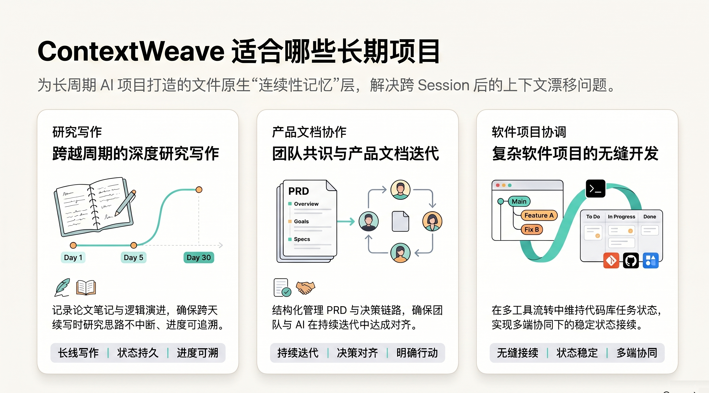
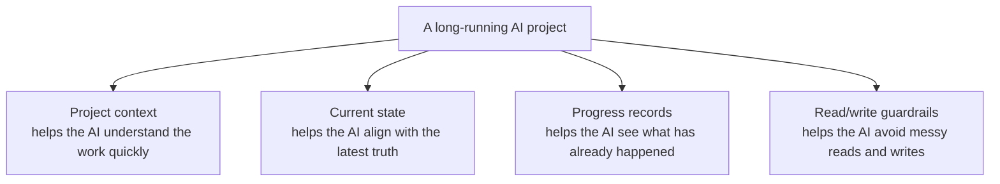
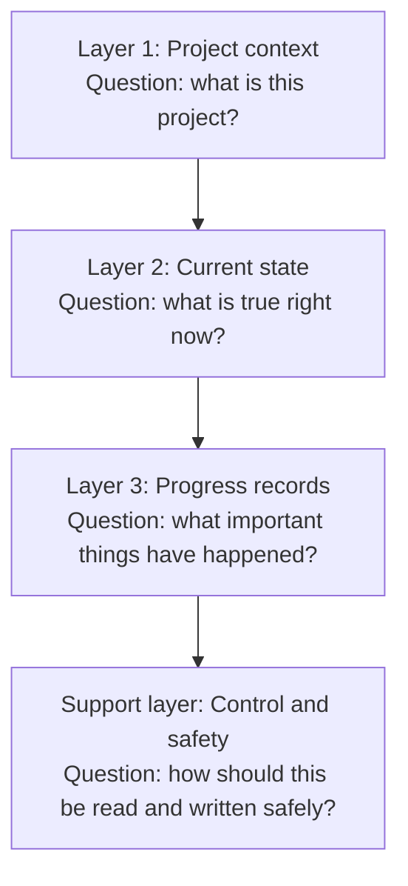
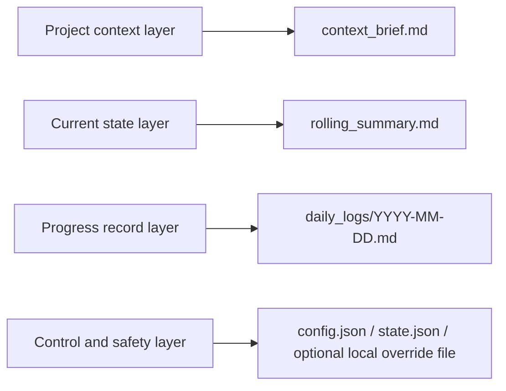
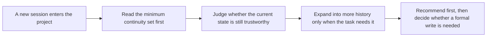

<div align="center">


<h1>🧶 ContextWeave</h1>

**A long-running project should not feel like it has to restart every time you switch models, agents, or sessions.**

[](./package-metadata.json)
[](./LICENSE)
[](./package-metadata.json)

**English** · [简体中文](./README.zh-CN.md)

</div>

ContextWeave keeps project background, current truth, key progress, and next action inside the workspace, so different models, different agents, and different collaborators can keep working from the same project reality.

## 💡 Why ContextWeave?

If you are already mixing `Claude Code`, `Codex`, `Gemini CLI`, `Qwen Code`, or even running multiple agents on the same project, you have probably felt some of these problems already:

- Every time you switch models, you end up re-explaining the project.
- Every time you hand work to a new agent, the why behind previous decisions starts to disappear.
- Platform memory only works inside that platform, so the moment the project moves, the memory breaks apart too.
- Every new collaborator has to figure out what is actually true right now.
- The longer a project runs, the more historical discussion, temporary ideas, and current conclusions blur together.

What slows long-running AI work down is often not weak model quality. It is **unstable project continuity**.

ContextWeave does not depend on a single chat window, and it does not ask you to trust a platform's private memory as the source of truth. Instead, it puts a small, explicit, reviewable continuity layer back into the project workspace itself, so that whoever picks the project up next can quickly answer four practical questions:

- 🎯 **Project purpose**: What is this project actually trying to do?
- 📍 **Current truth**: What is true right now?
- 🧗 **Progress so far**: What important milestones have already happened?
- 🚀 **Next action**: What is the most sensible thing to do next?

<p align="center">
  
</p>

## ✅ What You Get Right Away

- **You stop re-explaining the project every time you switch models**: key background, current state, progress, and next action already live in the workspace.
- **You stop relying on chat history when switching agents**: the current truth of the project no longer lives only in the previous window.
- **New collaborators can join the work more easily**: they do not need to read a long diff or a giant thread first just to understand where the project stands.
- **“What is true now” becomes its own object**: instead of mixing current conclusions with old discussion and temporary ideas.
- **Long-running work becomes file-carried instead of memory-carried**: whoever picks the project back up can align on truth first, then continue.

## ✨ The Core Idea

- **🛡️ File-native by design**: Continuity lives in plain Markdown and JSON inside the workspace, so it is easy to review, version, move, and recover.
- **⚡ Disciplined cold starts**: Instead of loading all history at once, it starts from the smallest useful continuity set and expands only when needed.
- **🧠 Layered continuity**: Stable context, current state, machine-readable control files, and milestone history are kept separate to reduce drift.
- **🔒 Recommendation before overwrite**: It can recommend recovery steps, workday handling, and next reviews without silently rewriting project state.
- **🧪 Built-in write guardrails**: When formal writes do happen, locks and validation help reduce accidental or messy state updates.
- **📅 Better recovery and resumption**: Workday suggestions, recovery proposals, and review records make long-running projects easier to continue safely.

## 🎯 Who It Fits Best And What Work It Fits Best

ContextWeave becomes much more valuable when a project has to continue across days, sessions, tools, models, or collaborators.

<p align="center">
  
</p>

- **People who mix platforms and models**: If you switch between tools like `Claude Code`, `Codex`, `Gemini CLI`, and `Qwen Code`, it helps reduce the cost of re-explaining the project every time.
- **People who use multiple agents on the same project**: If you run agents in parallel or keep handing work to fresh sessions, it helps stabilize project truth instead of leaving it inside one specific window.
- **Non-technical collaborators working on long-running projects**: In research, writing, product, content, operations, and similar work, not everyone reads code or long chat logs, but everyone still needs to know where the project stands.
- **Research writing and document collaboration**: Keep judgment, evidence, decisions, and next focus from drifting apart.
- **Software project coordination**: Keep implementation status, blockers, risks, and next actions visible across sessions.
- **Mixed long-running work**: If a project spans writing, research, product, code, and operations at the same time, the general continuity path is the safer default.

## 🗺️ What To Think Of It As

If this is your first time seeing ContextWeave, the easiest mental model is not a pile of internal file names.

> Think of it as a project handbook that lets whoever picks the work back up continue from the same truth.

That handbook is built around four simple parts:

- **One page of context**: So the AI knows what this project is.
- **One page of current state**: So the AI knows what is true right now.
- **A running record of progress**: So the AI knows what has actually happened.
- **A layer of read/write guardrails**: So the AI knows how to read carefully and when to write carefully.



## 🧱 How The Architecture Is Layered

Under the hood, ContextWeave is really solving four different problems:



| Layer | The question it answers | What the reader gets |
|---|---|---|
| Project context | What is this project? | New sessions do not need to rediscover the background from scratch. |
| Current state | What is true right now? | It becomes much easier to align on the latest facts. |
| Progress records | What important things have happened? | Completed work is easier to separate from unfinished discussion. |
| Control and safety | How should this be read and written safely? | Recovery gets steadier, and formal writes get more careful. |

### 1. Project Context Layer

This layer stores the things that should not change often, but still shape later decisions: project goals, current phase, boundaries, constraints, and key grounding information.

Its purpose is simple: when a new session joins the project, the AI should not need to ask all over again what the work is about.

### 2. Current State Layer

This layer stores the most trustworthy current judgment: the facts that currently hold, the risks that matter now, the open questions, and the next focus.

It solves a common problem: the AI does not have to guess the latest state from a pile of old conversation.

### 3. Progress Record Layer

This layer keeps the important things that actually happened, not every passing discussion fragment. It works more like a milestone trail than a backup of chat history.

That makes it easier for the AI to distinguish between "this was really done" and "this was only discussed before."

### 4. Control And Safety Layer

This layer is not mainly for humans to read. It exists so tools and helper scripts can keep the continuity layer orderly. It mainly helps an agent do four things:

- **What should be read first**: Avoid loading the entire history up front.
- **Whether the current context is fresh enough**: Reduce the risk of continuing from stale state.
- **When something should be reviewed before writing**: Make formal updates safer.
- **How to be more careful during formal writes**: Lower the chance of messy or conflicting state changes.

## 🗂️ How That Maps To Files

The four layers above are a reader-friendly model. In the actual package, they map onto files like this:



| Actual file | Role |
|---|---|
| `context_brief.md` | Stores stable background and long-lived project framing. |
| `rolling_summary.md` | Stores the current snapshot the next session should align to first. |
| `daily_logs/YYYY-MM-DD.md` | Stores milestone evidence and meaningful progress by date. |
| `config.json`, `state.json`, and the optional local override file | Help tools read in the right order and write more carefully. |

ContextWeave also includes a deliberately limited companion area for recovery proposals and review records. Its job is to keep those intermediate materials separate from the project's core truth files, so recovery stays clear and reviewable.

### At A Glance: What Shows Up In Your Project

By default, ContextWeave keeps a small continuity set in your project rather than scattering lots of loose cache files around.

```text
PROJECT_ROOT/
├── your-project-files...
└── .contextweave/                  # or contextweave/
    ├── config.json
    ├── state.json
    ├── context_brief.md
    ├── rolling_summary.md
    ├── local override file        # optional
    ├── daily_logs/
    │   └── YYYY-MM-DD.md
    └── companion/                 # appears only when needed
        └── recovery/
            ├── proposals/
            ├── review_log/
            └── archive/
```

An easier way to read that structure:

| File or directory | Plain-English meaning |
|---|---|
| `context_brief.md` | The project explainer that tells the AI what this work is. |
| `rolling_summary.md` | The working status board that tells the AI what is true now and what comes next. |
| `daily_logs/` | The progress record that shows what has actually happened. |
| `config.json` and `state.json` | The underlying settings and state that make tool behavior more stable. |
| `companion/` | A separate area for recovery proposals and review records, so they do not mix into the core truth files. |

If you are using ContextWeave normally, this small set of files is usually the main continuity surface you will see in the project.

## 🔄 How A New Session Picks The Project Back Up

The point is not to read every historical artifact. The point is to read the minimum useful continuity surface first, then expand only when needed.



That is why ContextWeave can do two useful things at once:

- **Faster cold starts**: New sessions can get useful context more quickly.
- **More careful formal writes**: Important updates are less likely to drift or land in the wrong place.

## 🏁 Quick Start

If what you care about right now is “how do I connect this to a real project today,” you can follow this path directly without reading everything first.

### Step 1: Pick the setup path that fits you best

#### Option A: I want the fastest possible trial

If your environment supports an open Skills CLI such as [skills.sh](https://skills.sh/docs/cli), the shortest path is to install directly:

```bash
npx skills add https://github.com/Frappucc1no/contextweave
```

Best for:

- People who want to try it quickly
- People already working in the Skills CLI ecosystem
- People who want to get it running first and decide later whether to keep it long-term

#### Option B: I want to use it long-term inside my existing AI tool

If your AI tool uses a directory-based skills setup, just install the entire repository directory into the appropriate skills folder. Do not copy only `SKILL.md`.

```bash
cp -R /path/to/contextweave /path/to/<skills-dir>/contextweave

# or
ln -s /absolute/path/to/contextweave /path/to/<skills-dir>/contextweave
```

Best for:

- People who want to use it long-term inside tools like `Codex`, `Claude Code`, or other directory-based skill environments
- People who want to make it a project-level default capability
- People who want to reuse the same continuity files across multiple tools

### If you are not sure which option to choose

Default recommendation:

- **Want to test quickly**: choose Option A
- **Want to use it long-term in a real project**: choose Option B
- **Want to reuse one continuity state across multiple tools**: prefer a project-level or directory-based install

### Common environments

| Environment | Recommended setup | Best when |
|---|---|---|
| Skills CLI ecosystem | `npx skills add https://github.com/Frappucc1no/contextweave` | You want the fastest possible trial. |
| Codex | Install into `.agents/skills/contextweave` | You want long-running work and project-level collaboration inside a repository. |
| Claude Code | Install into `~/.claude/skills/contextweave` or `.claude/skills/contextweave` | User-level or project-level installation. |
| Other tools that support directory-based skills | Install the whole directory into that tool's skills folder | You want to reuse the same continuity files across tools. |

### Step 2: Do not stop at installation - attach it to a real project immediately

Once the package is installed, the most useful next step is not to keep reading. It is this:

> Pick a real project you know you will return to, and connect it now.

That is the fastest way to feel whether it actually solves your problem.

#### Step 1: Initialize the project

If you are already inside the installed `contextweave/` package directory, run:

```bash
python3.13 scripts/init_context.py /absolute/path/to/project
python3.13 scripts/validate_context.py /absolute/path/to/project --json
```

#### Step 2: Confirm it is active

If your environment does not use `python3.13`, replace it with any available Python `3.10+` interpreter.

> When `validate_context.py` returns `"valid": true`, the project has been connected successfully.

#### Step 3: Go back to your AI tool and just speak naturally

Do not start by memorizing commands. Just use natural prompts such as:

| You can say | Best used when |
|---|---|
| `continue this project` | The project already has continuity files and you want to keep moving. |
| `restore project context` | You want to restore context first and decide what to do next after that. |
| `pick up where we left off` | You are returning to the same work after a previous session. |
| `record today's progress` | You want to capture today's meaningful progress. |

### Then: If you want to use it more seriously over time

Once you have run it on a real project once, these documents will make much more sense:

- Want a default workflow by work type: check `profiles/`
- Want to understand how the helper runtime works: read [USAGE.md](./USAGE.md)
- Want the file contract and state structure details: read [references/file-contracts.md](./references/file-contracts.md)

<details>
  <summary><strong>See a Codex project-level install example</strong></summary>

```bash
mkdir -p .agents/skills
ln -s /absolute/path/to/contextweave .agents/skills/contextweave
```

</details>

<details>
  <summary><strong>See a Claude Code user-level install example</strong></summary>

```bash
mkdir -p ~/.claude/skills/contextweave
rsync -a /absolute/path/to/contextweave/ ~/.claude/skills/contextweave/
```

</details>

### A simple but practical way to tell whether it is working

If you are not sure whether to use it long-term, the best test is not to read more pages. It is to do this:

1. Pick a project that is already halfway done.
2. Attach ContextWeave to it.
3. Come back a day later, or come back with a different model or agent.

If that moment feels noticeably easier because:

- you do not need to restate the background
- you do not need to dig through a long chat log
- the current state is easier to align on
- someone else can step in more easily

then it is valuable for your workflow.

## ❓ FAQ

<details>
  <summary><strong>Will it automatically edit my project code?</strong></summary>
  <p>No. It is not designed to silently take over your application code. Its main concern is the continuity layer itself, and when formal writes happen, they are framed around explicit triggers and safer update paths.</p>
</details>

<details>
  <summary><strong>Can I attach it to a project that is already in progress?</strong></summary>
  <p>Yes. That is one of the best use cases: you can add stable background, current state, and important progress to a project that is already moving, so future sessions can continue more easily.</p>
</details>

<details>
  <summary><strong>Is it only for coding projects?</strong></summary>
  <p>No. It also works well for research writing, product document collaboration, software project coordination, and mixed long-running projects. When a project does not clearly fit a specialized mode, the general continuity path is the safest default.</p>
</details>

<details>
  <summary><strong>Do I need to maintain a lot of files every day?</strong></summary>
  <p>No. The goal is a minimum useful continuity set, not turning every session into documentation work. Only the durable state that is actually worth keeping should be recorded.</p>
</details>

<details>
  <summary><strong>Will it leave a lot of stuff in my project?</strong></summary>
  <p>Usually not. The core is a small continuity set plus date-based progress records. Recovery proposals and review notes are also kept in their own area so the project tree stays cleaner.</p>
</details>

<details>
  <summary><strong>Do I have to commit to one specific AI tool?</strong></summary>
  <p>No. The whole idea is file-native continuity. As long as a tool can install this kind of skill package and read project files, it becomes much easier to carry the same project state across tools.</p>
</details>

## 🌟 Current Version Highlights

- **Workday recommendation**: Helps an agent judge which day of work is most appropriate to continue, reducing confusion across day boundaries.
- **Recovery proposals and review records**: Makes historical recovery clearer and easier to review collaboratively.
- **More stable cold starts**: Starts from the minimum useful continuity surface so new sessions can get into context faster.
- **Cleaner continuity asset organization**: Keeps continuity files, recovery materials, and auxiliary records in clearer places.
- **More reliable formal-write protection**: Adds stronger guardrails around writes that land in durable project state.

## 📚 Advanced Reading And Core References

Once your project is using ContextWeave, these are the core documents to read if you want to understand the write contract more deeply or build on top of it:

- 🤖 [**SKILL.md**](./SKILL.md): Best when you want to see how an agent is expected to enter ContextWeave, choose the right profile, and use it in practice.
- 📖 [**USAGE.md**](./USAGE.md): Best when you want helper runtime usage details and human-in-the-loop guidance.
- 🔐 [**references/file-contracts.md**](./references/file-contracts.md): Best when you want to understand what counts as a valid state update at the file-contract level.

## 📄 License

This project is released under Apache License 2.0. See [LICENSE](./LICENSE) and [NOTICE](./NOTICE) for details.
