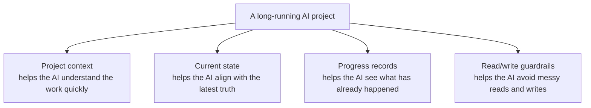
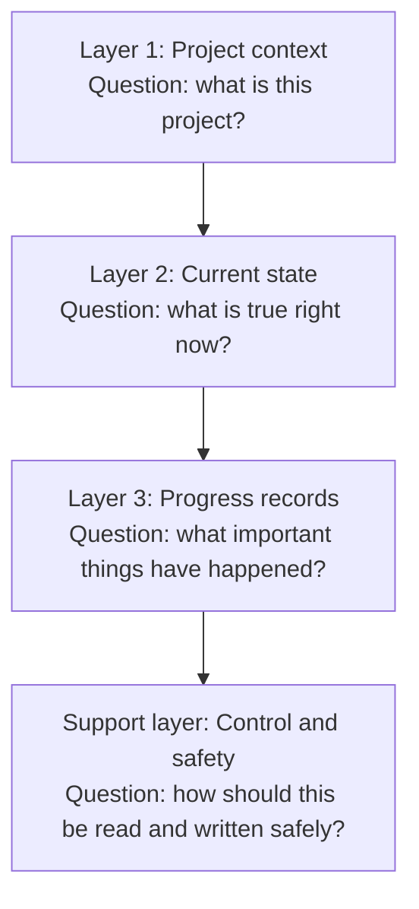
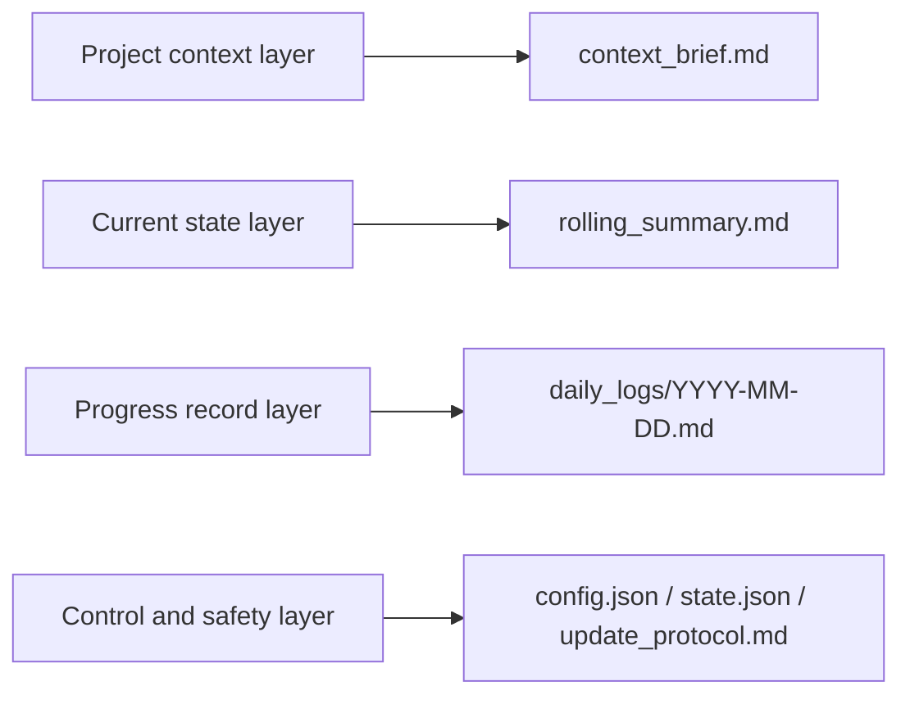
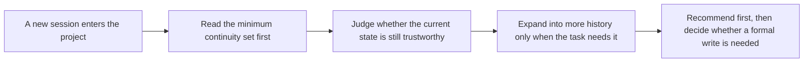

# 🧶 ContextWeave

<div align="center">

**A file-native continuity layer for long-running AI projects.**

[](./LICENSE)
[](./package-metadata.json)
[](./package-metadata.json)

**English** · [简体中文](./README.zh-CN.md)

</div>

## 💡 Why ContextWeave?

In long-running AI work, the biggest source of friction usually is not model quality. It is what happens after a session ends: the project keeps going, but the context drifts.

ContextWeave does not depend on a single chat window, and it does not ask you to trust a platform's private memory as the source of truth. Instead, it keeps a small, explicit, reviewable continuity layer inside the project workspace itself, so the next session can quickly answer four practical questions:

<table>
  <tr>
    <td width="50%"><strong>🎯 Project purpose</strong><br/>What is this project actually trying to do?</td>
    <td width="50%"><strong>📍 Current truth</strong><br/>What is true right now?</td>
  </tr>
  <tr>
    <td><strong>🧗 Progress so far</strong><br/>What important milestones have already happened?</td>
    <td><strong>🚀 Next action</strong><br/>What is the most sensible thing to do next?</td>
  </tr>
</table>

## ✨ The Core Idea

| Approach | What the reader actually gets |
|---|---|
| **🛡️ File-native by design** | Continuity lives in plain Markdown and JSON inside the workspace, so it is easy to review, version, move, and recover. |
| **⚡ Disciplined cold starts** | Instead of loading all history at once, it starts from the smallest useful continuity set and expands only when needed. |
| **🧠 Layered continuity** | Stable context, current state, machine-readable control files, and milestone history are kept separate to reduce drift. |
| **🔒 Recommendation before overwrite** | It can recommend recovery steps, workday handling, and next reviews without silently rewriting project state. |
| **🧪 Built-in write guardrails** | When formal writes do happen, locks and validation help reduce accidental or messy state updates. |
| **📅 Better recovery and resumption** | Workday suggestions, recovery proposals, and review records make long-running projects easier to continue safely. |

## 🗺️ What To Think Of It As

If this is your first time seeing ContextWeave, the easiest mental model is not a pile of internal file names.

> Think of it as a durable project handbook that an AI can safely pick back up later.

That handbook is built around four simple parts:

<table>
  <tr>
    <td width="50%"><strong>One page of context</strong><br/>So the AI knows what this project is.</td>
    <td width="50%"><strong>One page of current state</strong><br/>So the AI knows what is true right now.</td>
  </tr>
  <tr>
    <td><strong>A running record of progress</strong><br/>So the AI knows what has actually happened.</td>
    <td><strong>A layer of read/write guardrails</strong><br/>So the AI knows how to read carefully and when to write carefully.</td>
  </tr>
</table>



## 🧱 How The Architecture Is Layered

Under the hood, ContextWeave is really solving four different problems:



| Layer | The question it answers | What the reader gets |
|---|---|---|
| Project context | What is this project? | New sessions do not need to rediscover the background from scratch. |
| Current state | What is true right now? | It becomes much easier to align on the latest facts. |
| Progress records | What important things have happened? | Completed work is easier to separate from unfinished discussion. |
| Control and safety | How should this be read and written safely? | Recovery gets steadier, and formal writes get more careful. |

### 1. Project Context Layer

This layer stores the things that should not change often, but still shape later decisions: project goals, current phase, boundaries, constraints, and key grounding information.

Its purpose is simple: when a new session joins the project, the AI should not need to ask all over again what the work is about.

### 2. Current State Layer

This layer stores the most trustworthy current judgment: the facts that currently hold, the risks that matter now, the open questions, and the next focus.

It solves a common problem: the AI does not have to guess the latest state from a pile of old conversation.

### 3. Progress Record Layer

This layer keeps the important things that actually happened, not every passing discussion fragment. It works more like a milestone trail than a backup of chat history.

That makes it easier for the AI to distinguish between "this was really done" and "this was only discussed before."

### 4. Control And Safety Layer

This layer is not mainly for humans to read. It exists so tools and helper scripts can keep the continuity layer orderly.

| What it helps judge | Why that matters |
|---|---|
| What should be read first | Avoids loading the entire history up front. |
| Whether the current context is fresh enough | Reduces the risk of continuing from stale state. |
| When something should be reviewed before writing | Makes formal updates safer. |
| How to be more careful during formal writes | Lowers the chance of messy or conflicting state changes. |

## 🗂️ How That Maps To Files

The four layers above are a reader-friendly model. In the actual package, they map onto files like this:



| Actual file | Role |
|---|---|
| `context_brief.md` | Stores stable background and long-lived project framing. |
| `rolling_summary.md` | Stores the current snapshot the next session should align to first. |
| `daily_logs/YYYY-MM-DD.md` | Stores milestone evidence and meaningful progress by date. |
| `config.json`, `state.json`, `update_protocol.md` | Help tools read in the right order and write more carefully. |

ContextWeave also includes a deliberately limited companion area for recovery proposals and review records. Its job is to keep those intermediate materials separate from the project's core truth files, so recovery stays clear and reviewable.

### At A Glance: What Shows Up In Your Project

By default, ContextWeave keeps a small continuity set in your project rather than scattering lots of loose cache files around.

```text
PROJECT_ROOT/
├── your-project-files...
└── .contextweave/                  # or contextweave/
    ├── config.json
    ├── state.json
    ├── context_brief.md
    ├── rolling_summary.md
    ├── update_protocol.md         # optional
    ├── daily_logs/
    │   └── YYYY-MM-DD.md
    └── companion/                 # appears only when needed
        └── recovery/
            ├── proposals/
            ├── review_log/
            └── archive/
```

An easier way to read that structure:

| File or directory | Plain-English meaning |
|---|---|
| `context_brief.md` | The project explainer that tells the AI what this work is. |
| `rolling_summary.md` | The working status board that tells the AI what is true now and what comes next. |
| `daily_logs/` | The progress record that shows what has actually happened. |
| `config.json` and `state.json` | The underlying settings and state that make tool behavior more stable. |
| `companion/` | A separate area for recovery proposals and review records, so they do not mix into the core truth files. |

If you are using ContextWeave normally, this small set of files is usually the main continuity surface you will see in the project.

## 🔄 How A New Session Picks The Project Back Up

The point is not to read every historical artifact. The point is to read the minimum useful continuity surface first, then expand only when needed.



That is why ContextWeave can do two useful things at once:

| Benefit | What it means in practice |
|---|---|
| Faster cold starts | New sessions can get useful context more quickly. |
| More careful formal writes | Important updates are less likely to drift or land in the wrong place. |

## 🏁 Quick Start

### Recommended: If Your Environment Supports Skills CLI

If your environment supports an open Skills CLI such as [skills.sh](https://skills.sh/docs/cli), you can install directly:

```bash
npx skills add https://github.com/Frappucc1no/contextweave
```

### General Option: Directory-Based Installation

If your AI tool uses a directory-based skills setup, just install the entire repository directory into the appropriate skills folder. Do not copy only `SKILL.md`.

```bash
cp -R /path/to/contextweave /path/to/<skills-dir>/contextweave

# or
ln -s /absolute/path/to/contextweave /path/to/<skills-dir>/contextweave
```

### Supported Environments

| Environment | How to install | Best fit |
|---|---|---|
| Skills CLI ecosystem | `npx skills add https://github.com/Frappucc1no/contextweave` | People who want the shortest installation path. |
| Codex | Install into `.agents/skills/contextweave` | Project-level collaboration and long-running work inside a repository. |
| Claude Code | Install into `~/.claude/skills/contextweave` or `.claude/skills/contextweave` | User-level or project-level installation. |
| Other tools that support directory-based skills | Install the whole directory into that tool's skills folder | People who want to reuse the same continuity layer across tools. |

### The First Minute After Installation

Once the package is installed, the most useful next step is to attach the continuity layer to a real project and confirm that it works.

**Step 1: Initialize the project**

If you are already inside the installed `contextweave/` package directory, run:

```bash
python3.13 scripts/init_context.py /absolute/path/to/project
python3.13 scripts/validate_context.py /absolute/path/to/project --json
```

**Step 2: Confirm it is active**

If your environment does not use `python3.13`, replace it with any available Python `3.10+` interpreter.

> When `validate_context.py` returns `"valid": true`, the project has been connected successfully.

**Step 3: Go back to your AI tool and start naturally**

From there, you can just use natural prompts such as:

| You can say | Best used when |
|---|---|
| `continue this project` | The project already has continuity files and you want to keep moving. |
| `restore project context` | You want to restore context first and decide what to do next after that. |
| `pick up where we left off` | You are returning to the same work after a previous session. |
| `record today's progress` | You want to capture today's meaningful progress. |

<details>
  <summary><strong>See a Codex project-level install example</strong></summary>

```bash
mkdir -p .agents/skills
ln -s /absolute/path/to/contextweave .agents/skills/contextweave
```

</details>

<details>
  <summary><strong>See a Claude Code user-level install example</strong></summary>

```bash
mkdir -p ~/.claude/skills/contextweave
rsync -a /absolute/path/to/contextweave/ ~/.claude/skills/contextweave/
```

</details>

## ❓ FAQ

<details>
  <summary><strong>Will it automatically edit my project code?</strong></summary>
  <p>No. It is not designed to silently take over your application code. Its main concern is the continuity layer itself, and when formal writes happen, they are framed around explicit triggers and safer update paths.</p>
</details>

<details>
  <summary><strong>Can I attach it to a project that is already in progress?</strong></summary>
  <p>Yes. That is one of the best use cases: you can add stable background, current state, and important progress to a project that is already moving, so future sessions can continue more easily.</p>
</details>

<details>
  <summary><strong>Is it only for coding projects?</strong></summary>
  <p>No. It also works well for research writing, product document collaboration, and software project coordination—any work that unfolds over time and benefits from cross-session continuity.</p>
</details>

<details>
  <summary><strong>Do I need to maintain a lot of files every day?</strong></summary>
  <p>No. The goal is a minimum useful continuity set, not turning every session into documentation work. Only the durable state that is actually worth keeping should be recorded.</p>
</details>

<details>
  <summary><strong>Will it leave a lot of stuff in my project?</strong></summary>
  <p>Usually not. The core is a small continuity set plus date-based progress records. Recovery proposals and review notes are also kept in their own area so the project tree stays cleaner.</p>
</details>

<details>
  <summary><strong>Do I have to commit to one specific AI tool?</strong></summary>
  <p>No. The whole idea is file-native continuity. As long as a tool can install this kind of skill package and read project files, it becomes much easier to carry the same project state across tools.</p>
</details>

## 🌟 Current Version Highlights

| Highlight | What it means for the reader |
|---|---|
| Workday recommendation | Helps an agent judge which day of work is most appropriate to continue, reducing confusion across day boundaries. |
| Recovery proposals and review records | Makes historical recovery clearer and easier to review collaboratively. |
| More stable cold starts | Starts from the minimum useful continuity surface so new sessions can get into context faster. |
| Cleaner continuity asset organization | Keeps continuity files, recovery materials, and auxiliary records in clearer places. |
| More reliable formal-write protection | Adds stronger guardrails around writes that land in durable project state. |

## 📚 Advanced Reading And Core References

Once your project is using ContextWeave, these are the core documents to read if you want to understand the write contract more deeply or build on top of it:

| Document | Best read when |
|---|---|
| 🤖 [**SKILL.md**](./SKILL.md) | You want to see how an agent is expected to enter and use ContextWeave in practice. |
| 📖 [**USAGE.md**](./USAGE.md) | You want helper runtime usage details and human-in-the-loop guidance. |
| 📜 [**references/protocol.md**](./references/protocol.md) | You want the full continuity model underneath the package. |
| 🔐 [**references/file-contracts.md**](./references/file-contracts.md) | You want to understand what counts as a valid state update at the file-contract level. |

## 📄 License

This project is released under Apache License 2.0. See [LICENSE](./LICENSE) and [NOTICE](./NOTICE) for details.
