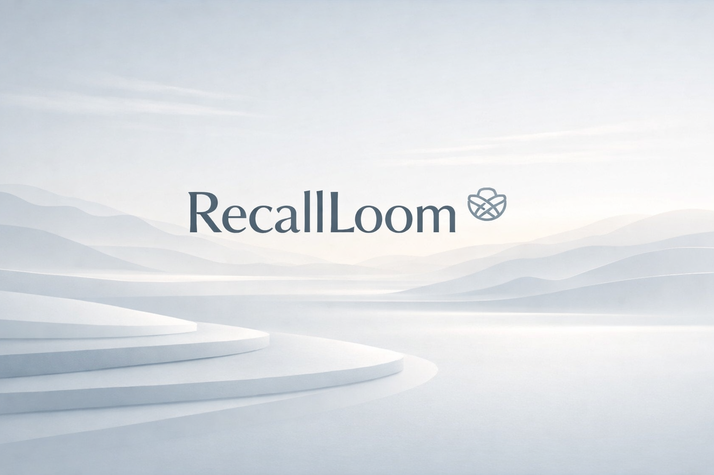
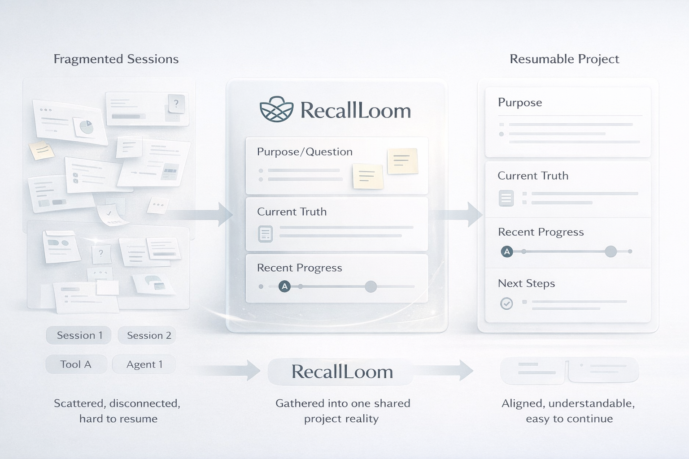
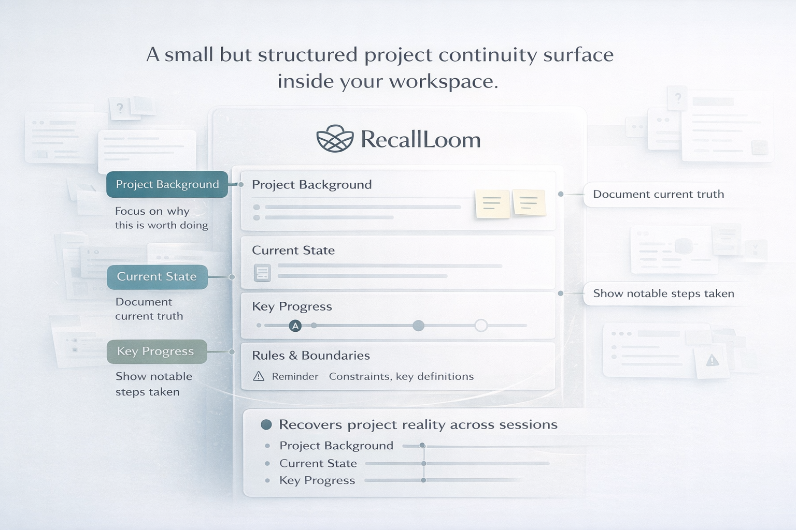
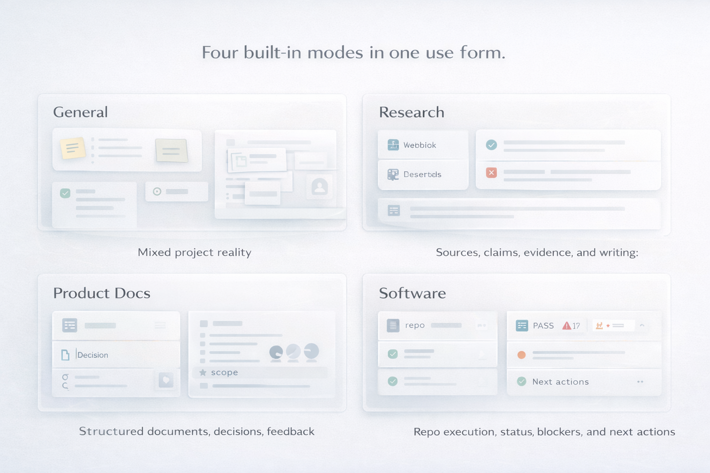
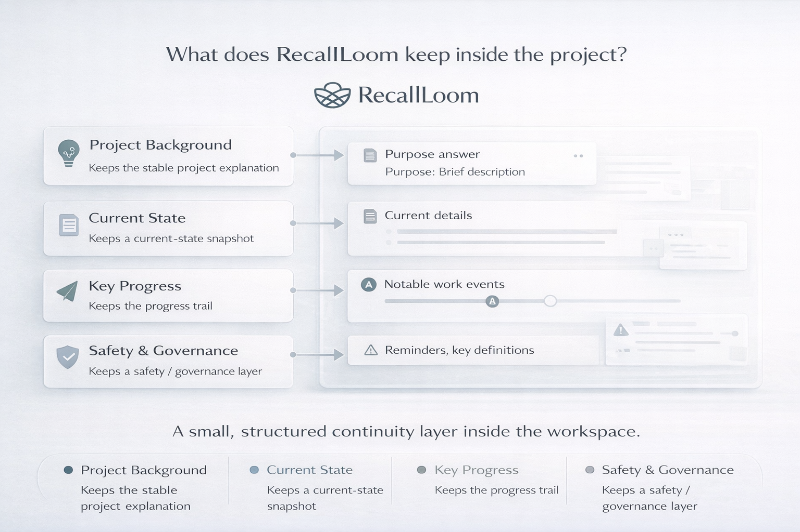

<div align="center">

<h1>🧶 RecallLoom</h1>

**Let the project remember itself.**

**Built for projects that keep moving across agents, sessions, and models.**

[](./skills/recallloom/package-metadata.json)
[](./LICENSE)
[](./skills/recallloom/package-metadata.json)

**English** · [简体中文](./README.zh-CN.md)

</div>



If every time you switch to a new `Claude Code`, `Codex`, `Gemini CLI`, or fresh agent you spend ten minutes re-explaining the project, what you are missing is usually not a smarter model. It is a continuity layer that does not disappear.

RecallLoom keeps the project's why, current truth, recent progress, and next move inside the workspace instead of locking them inside one platform's private memory. It is not another dashboard, not a platform-locked memory silo, and not a silent full-repo understanding engine. It works more like a stable layer of project truth for long-running work, so the next session can pick up immediately.

**Quick links:** [What problem it solves](#what-problem-it-solves) · [Who it fits best](#who-it-fits-best) · [Quick start](#quick-start) · [Built-in work modes](#built-in-work-modes) · [FAQ](#faq)

<a id="what-problem-it-solves"></a>
## 💥 What Problem It Solves

If you already work across tools, models, and sessions, this probably feels familiar:

- Every tool switch comes with another restart tax.
- A fresh session can see what is in the repo, but not why it ended up this way.
- A new agent can easily misread what is actually true right now.
- As the project grows, old discussion and current conclusions start blurring together.

What slows long-running AI work down is often not weak model quality. It is **broken project continuity**.

RecallLoom is deliberately narrow. It does not try to understand everything from nothing. It keeps the project reality that has already been made explicit and is worth carrying forward.



## 🧭 How It Works

The easiest way to think about RecallLoom is as a small, clear continuity structure that stays with the project itself. Instead of turning everything into one giant note, it separates the project into four parts that are worth preserving over time:

- **Project background**: what this project is and why it is being done this way.
- **Current state**: where things stand now and which judgments are still valid.
- **Key progress**: what actually happened recently and which decisions are worth revisiting.
- **Rules and boundaries**: what should be handled carefully and what should not be changed lightly.

A fresh session does not need to ingest all prior history. It needs to restore these four parts first, then decide what to do next.



<a id="who-it-fits-best"></a>
## 🎯 Who Will Feel The Value Fastest

If you fall into one of these groups, RecallLoom usually clicks quickly:

- **People already using AI inside real projects**: especially solo builders and very small teams who keep handing the same project between different sessions, models, and agents.
- **People who regularly switch between tools like `Claude Code`, `Codex`, and `Gemini CLI`**: and do not want to re-explain the project every time.
- **Research writing, product docs, and software coordination work**: the kind of work where why, decisions, progress, and next steps are easy to lose.

Typical high-value moments are just as focused:

- **Coming back after time passes**: a day, a week, or longer later, without rebuilding the project from old chat history.
- **Passing work across models or agents**: use Claude today, Codex, Gemini CLI, or another agent tomorrow, and keep the project state intact.
- **Long-running research, PRD, or software coordination work**: work where current truth and historical logic are easy to lose.

If your use case is one-off chatting, disposable prompts, or work you never return to, RecallLoom will matter less.

<a id="built-in-work-modes"></a>
## 🧩 Built-In Work Modes

Once the product fit feels clear, mode choice becomes much easier. RecallLoom ships with four built-in modes so the same continuity structure can fit different project shapes. If you are unsure, start with the general mode.

| Mode | Best when | What it helps keep steady |
|---|---|---|
| General | The project mixes research, writing, product, code, or operations | The overall project reality, without narrowing the project too early |
| Research | The work is driven by sources, claims, evidence, and long-form writing | Claims, evidence, and writing progress |
| Product Docs | The work is driven by PRDs, RFCs, strategy docs, and stakeholder alignment | Scope, decisions, and open questions |
| Software | The work is driven by engineering planning, repo execution, and implementation follow-through | Status, blockers, and next actions |

Typical natural-language triggers once the skill is installed:

- `continue this project`
- `restore project context`
- `pick up where we left off`
- `record today's progress`



## ✨ Why It Helps Without Becoming Heavy

RecallLoom works because it does not try to remember everything in one place. It keeps only the parts of project reality that are worth carrying over time, and keeps them separate, so the next session has a smaller, steadier surface to stand on first.

| Part of the continuity structure | What it helps the next session recover |
|---|---|
| Project background | What this project is and how to approach it |
| Current state | What is true right now |
| Key progress | What actually happened, not just what was discussed |
| Rules and boundaries | When to read more carefully and when to write more carefully |

That is what makes it useful without making it feel heavy.



## 🧱 These Choices Are Deliberate

- **It does not pollute the main project surface**: continuity state lives in a sidecar instead of being forced into your core code, docs, and repository structure.
- **It does not pretend to understand the whole repo from zero**: it focuses on recovering project background, current state, key progress, and boundaries instead of acting like a universal repository reader.
- **It chooses trust before automation**: it would rather make project reality clear than look clever while hiding uncertainty behind a black box.

<details>
  <summary><strong>See how it lands in the project</strong></summary>

| Plain-English layer | File in the project |
|---|---|
| Project background | `context_brief.md` |
| Current state | `rolling_summary.md` |
| Key progress | `daily_logs/YYYY-MM-DD.md` |
| Rules and boundaries | `config.json`, `state.json`, optional `update_protocol.md` |

```text
PROJECT_ROOT/
├── your-project-files...
└── .recallloom/                    # or recallloom/
    ├── context_brief.md
    ├── rolling_summary.md
    ├── daily_logs/
    ├── config.json
    ├── state.json
    ├── update_protocol.md          # optional
    └── companion/                  # appears only when needed
```

</details>

<a id="quick-start"></a>
## 🚀 Quick Start

For first-time onboarding, there is really only one action worth remembering: `rl-init`. The rest of the flow is just four steps:

1. Install the skill locally.
2. Explicitly invoke RecallLoom once in the conversation.
3. If the project is not attached yet, confirm initialization or type `rl-init`.
4. Continue the project normally.

### Step 1: Install it

#### Option A: Fastest possible trial

If your environment supports an open Skills CLI such as [skills.sh](https://skills.sh/docs/cli), install directly:

```bash
npx skills add https://github.com/Frappucc1no/recall-loom --skill recallloom
```

#### Option B: Long-term use inside your existing AI tool

If your tool uses a directory-based skills setup, install the whole package directory into the appropriate skills folder:

```bash
cp -R /path/to/recall-loom/skills/recallloom /path/to/<skills-dir>/recallloom

# or
ln -s /absolute/path/to/recall-loom/skills/recallloom /path/to/<skills-dir>/recallloom
```

### Step 2: Explicitly invoke RecallLoom once

On first use, explicitly wake RecallLoom up in the conversation.

The exact surface depends on the host, but the intent is the same:

- pick `recallloom` from the host's skill picker
- or use `@recallloom`
- or use the host's `/skill` flow to select RecallLoom
- or simply say: `Use RecallLoom for this project`

The point of this step is simple: the agent should first decide whether the current project is already attached to RecallLoom.

It should then:

- if it is, quietly continue
- if it is not, move into initialization confirmation

### Step 3: Confirm, or just type `rl-init`

The one action worth remembering is:

- `rl-init`

If the agent determines that the current project is not initialized yet, it should ask whether you want to initialize it. At that point you can:

- confirm directly
- or simply type: `rl-init`

That should trigger the standard initialization action:

- initialize the sidecar
- validate the workspace
- return next-step guidance

### Step 4: Continue the project normally

Once initialization is done, RecallLoom should fall back into its more natural role:

- available when needed
- useful during resume, restore, and progress-capture moments
- low additional operating cost

Typical next prompts are:

| You can say | Best used when |
|---|---|
| `continue this project` | The project already has continuity files and you want to keep moving |
| `restore project context` | You want to restore context first and decide what to do next |
| `pick up where we left off` | You are returning to the same work after a previous session |
| `record today's progress` | You want to capture meaningful progress in the continuity files |

If you later want to map `rl-init` into host-native local commands, treat that as an optional convenience layer. The main path is still: install the skill, explicitly wake RecallLoom once, and use `rl-init` when initialization is needed.

If you want the underlying operator flow instead of this conversational flow, see [USAGE.md](./USAGE.md).

## 📦 If You Want The Skill-Package View

Most first-time readers can skip the internal package shape. Come back to this section when you want the install and integration view.

<details>
  <summary><strong>See the package shape</strong></summary>

```text
recallloom/
├── SKILL.md
├── profiles/
├── references/
├── scripts/
├── native_commands/
├── package-metadata.json
└── ...
```

| Part | Role |
|---|---|
| `SKILL.md` | Agent-facing entrypoint and default workflow |
| `profiles/` | Guidance for different project shapes |
| `references/` | Protocol details, file contracts, and playbooks |
| `scripts/` | Helpers for the unified entrypoint, init, validation, status, bridge, and guarded writes |
| `native_commands/` | Optional host-native command templates for supported CLIs |
| `package-metadata.json` | Version and capability metadata |

</details>

<details>
  <summary><strong>See package facts and runtime assumptions</strong></summary>

### Package Facts

<!-- RecallLoom metadata sync start: package-metadata -->
- package version: `0.3.1`
- protocol version: `1.0`
- supported protocol versions:
  - `1.0`
<!-- RecallLoom metadata sync end: package-metadata -->

### Runtime Assumptions

<!-- RecallLoom metadata sync start: runtime-assumptions -->
- Python 3.10 or newer
- supported workspace languages:
  - `en`
  - `zh-CN`
- supported bridge targets:
  - `AGENTS.md`
  - `CLAUDE.md`
  - `GEMINI.md`
  - `.github/copilot-instructions.md`
<!-- RecallLoom metadata sync end: runtime-assumptions -->

</details>

<details>
  <summary><strong>See common install locations</strong></summary>

| Environment | Recommended setup | Best when |
|---|---|---|
| Skills CLI ecosystem | `npx skills add https://github.com/Frappucc1no/recall-loom --skill recallloom` | You want the fastest possible trial |
| Codex | Install into `.agents/skills/recallloom` | You want project-level, long-running repository collaboration |
| Claude Code | Install into `~/.claude/skills/recallloom` or `.claude/skills/recallloom` | You want user-level or project-level installation |
| Other directory-based tools | Install the whole directory into that tool's skills folder | You want to reuse the same continuity files across tools |

</details>

<a id="faq"></a>
## ❓ FAQ

<details>
  <summary><strong>Will it automatically edit my project code?</strong></summary>
  <p>No. Its primary concern is the continuity layer itself. Formal writes are meant to happen through explicit triggers and safer update paths.</p>
</details>

<details>
  <summary><strong>If there is barely any chat history or captured project state, will it still understand the whole project automatically?</strong></summary>
  <p>No. RecallLoom is not a zero-context full-repo understanding engine. It works best when project background, current state, key progress, and boundaries have already been captured in a form the next session can restore. If those signals barely exist yet, it cannot magically invent a complete project reality.</p>
</details>

<details>
  <summary><strong>Does it run silently in the background all the time?</strong></summary>
  <p>Not in the strong sense people usually mean. A better way to think about it today is that it becomes most valuable at clear checkpoints: when you continue work, restore context, finish an important step, prepare a handoff, or capture meaningful progress. That does not mean you have to micromanage it all day.</p>
</details>

<details>
  <summary><strong>Can I attach it to a project that is already in progress?</strong></summary>
  <p>Yes. That is one of the best use cases: add stable background, current state, and important progress to a project that is already moving so future sessions can continue more easily.</p>
</details>

<details>
  <summary><strong>Is it only for coding projects?</strong></summary>
  <p>No. It also works well for research writing, product document collaboration, software project coordination, and mixed long-running projects. If a project does not clearly fit a specialized mode, the general continuity path is the safest default.</p>
</details>

<details>
  <summary><strong>Do I need to maintain a lot of files every day?</strong></summary>
  <p>No. The goal is a minimum useful continuity set, not turning every session into documentation work. Only durable project state that is actually worth keeping should be recorded.</p>
</details>

<details>
  <summary><strong>Do I have to commit to one specific AI tool?</strong></summary>
  <p>No. RecallLoom is built around file-native continuity. The most direct bridge targets today include `AGENTS.md`, `CLAUDE.md`, `GEMINI.md`, and `.github/copilot-instructions.md`, so it is better thought of as something that travels with the project than something locked inside a single platform's private memory.</p>
</details>

<details>
  <summary><strong>Why use a sidecar instead of writing directly into the main project files?</strong></summary>
  <p>Because that separation is intentional. A sidecar lets continuity state stay next to the project and travel with it, while reducing pollution of the project's primary code, docs, and repository structure.</p>
</details>

## 📚 Further Reading

- [SKILL.md](./skills/recallloom/SKILL.md)
- [USAGE.md](./USAGE.md)
- [profiles/](./skills/recallloom/profiles/)
- [file-contracts.md](./skills/recallloom/references/file-contracts.md)
- [protocol.md](./skills/recallloom/references/protocol.md)

## 📄 License

This project is released under Apache License 2.0. See [LICENSE](./LICENSE) and [NOTICE](./NOTICE).
