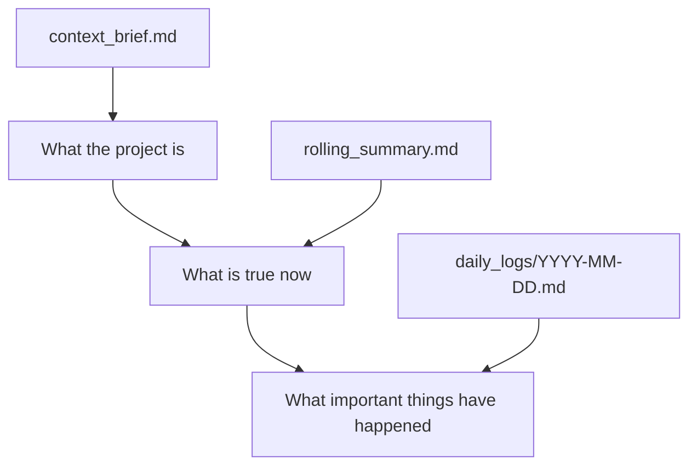
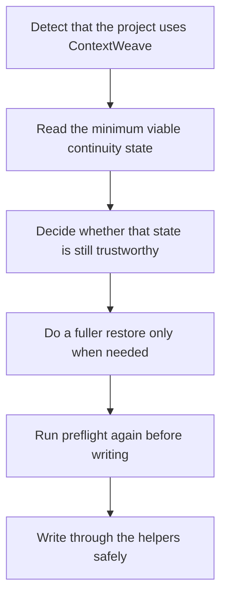

# ContextWeave

> 🧭 A continuity skill for long-running projects.  
> Keep the key state of a project stable, so AI can re-enter the right context faster the next time work resumes.

[简体中文](./README.zh-CN.md) · English

[](./LICENSE)
[](./package-metadata.json)
[](./package-metadata.json)
[](./package-metadata.json)

**Keywords:** AI agents, project continuity, cross-session memory, project state management, project continuity, context harness, session continuity

## ✨ What It Is

`ContextWeave` is a continuity skill for long-running projects.  
It does not try to push everything into permanent memory. Instead, it captures only the project state that actually matters, so AI can still answer these questions quickly when work resumes across sessions, days, or tools:

- What is this project?
- What is true right now?
- What important progress has already happened?
- What is most worth doing next?

Its value is not “one more memory layer.”  
Its value is turning project continuity into a stable set of project assets instead of leaving it inside transient conversations.

## 🎯 When It Fits Best

`ContextWeave` is a better fit when:

- one project spans days or weeks
- you switch between sessions, tools, or agents
- current state, history, and framing start to blur together over time
- decisions that were already made need to be re-explained again later

The current package is especially aligned with three project shapes:

- research writing
- product document collaboration
- software project coordination and ongoing delivery

## 🚀 What Problem It Solves

Many AI agents look strong at the start of a task, but once a project becomes long-running, the same class of problems tends to appear:

- project background has to be explained again after a pause
- current state and historical process collapse into one messy stream
- different tools or sessions drift toward different understandings of where the project stands
- important conclusions were discussed, but never formalized

`ContextWeave` does not try to become a general memory database.  
What it does instead is simple and specific:

> use a lightweight file structure to make project continuity durable.

## 🧠 Why This Is Closer to a Harness Pattern

If the problem is framed only as “how should context be organized,” the focus usually stays on:

- how prompts are structured
- what the model sees in the current session
- how memory is trimmed or appended

`ContextWeave` tackles a downstream problem:

> when a project runs across days or weeks, how do you make the working state of that project persist, instead of rebuilding a fresh context bundle every time?

That is why it is better described as a lightweight harness layer.  
Here, `harness` does **not** mean a heavy autonomous agent platform. It means a minimal but structured continuity layer.

It already shows three typical harness-style properties:

### 1. A formal state surface

Project continuity does not live only in the chat window. It also lives in explicit state files and machine-readable structure, including:

- `config.json`
- `state.json`
- managed file markers

### 2. A recovery path

This is not “read a few files and hope it works.” There is a deliberate flow around recovery:

- detect whether the project uses a continuity system
- read the minimum viable state
- decide whether that state is still trustworthy
- do a fuller restore only when needed

### 3. Write gates

The current `0.1.0` line already includes:

- revision-aware helpers
- write locking
- atomic replace
- rollback / fail-closed behavior

So this is not just a document template pack. It is better understood as a lightweight project continuity harness delivered as a skill.

## 📌 A Common Scenario

Imagine you are working on a PRD, a research project, or a software change:

- On day 1, you and AI establish the direction and key judgments.
- On day 2, you return and do not want to restate all the background.
- On day 3, you continue in a different tool.
- On day 4, you just want to know what is true now and what should happen next.

`ContextWeave` handles that by doing three simple things:

- one file keeps the stable framing
- one file keeps the current state
- dated logs keep important milestone evidence

That makes later work feel like continuing from an existing project state instead of guessing the project from scratch again.

## 🗂️ Core Structure at a Glance

`ContextWeave` separates project continuity into three layers:



### `context_brief.md`

Stores stable framing such as:

- project goal
- current phase
- source of truth
- stable boundaries and constraints

### `rolling_summary.md`

Stores the current-state snapshot such as:

- currently valid facts
- active judgments
- risks and open questions
- next step

### `daily_logs/YYYY-MM-DD.md`

Stores milestone evidence such as:

- completed work
- key decisions
- confirmed facts
- blockers and recommended next steps

## 🔒 Why This Is More Than “A Few Project Files”

`ContextWeave` is file-based, but it is not just “manually maintain a few markdown files.”  
The current `0.1.0` line already includes:

- `config.json` as workspace configuration truth
- `state.json` as machine state truth
- a machine-readable contract
- revision-aware commit / append helpers
- project-scoped write locking
- rollback / fail-closed behavior

That makes it a continuity system with formal boundaries, not just a documentation template.

## 🏁 Installation

### Recommended path

If your environment supports [skills.sh](https://skills.sh/docs/cli)-style Skills CLI workflows, install with:

```bash
npx skills add https://github.com/Frappucc1no/contextweave
```

### Directory-based integration

If your tool uses directory-based skills, keep the entire repository intact and mount it into the appropriate skills directory. Do not copy only `SKILL.md`.

```bash
cp -R /path/to/contextweave /path/to/<skills-dir>/contextweave

# or
ln -s /absolute/path/to/contextweave /path/to/<skills-dir>/contextweave
```

### Common environments

| Environment | Integration method |
|---|---|
| Skills CLI ecosystems | `npx skills add https://github.com/Frappucc1no/contextweave` |
| Codex | mount into `.agents/skills/contextweave` |
| Claude Code | mount into `~/.claude/skills/contextweave` or `.claude/skills/contextweave` |
| Other directory-based environments | mount the full directory into that tool's skills path |

Example project-level install for Codex:

```bash
mkdir -p .agents/skills
ln -s /absolute/path/to/contextweave .agents/skills/contextweave
```

Example user-level install for Claude Code:

```bash
mkdir -p ~/.claude/skills/contextweave
rsync -a /absolute/path/to/contextweave/ ~/.claude/skills/contextweave/
```

## 📦 Repository Layout

This repository root is the skill package root:

```text
contextweave/
├── SKILL.md
├── README.md
├── USAGE.md
├── package-metadata.json
├── profiles/
├── references/
├── scripts/
├── LICENSE
└── NOTICE
```

For installation and distribution, treat the whole directory as a single skill package.

## 🔄 How It Helps AI Stay Aligned



The point of this flow is straightforward:

- restore first
- judge second
- gate formal writes before applying them

That is the difference between `ContextWeave` and “just keeping a few project notes.”

## 🧩 Relationship to Platform Memory Features

`ContextWeave` should not be read as a replacement for platform-native memory, compaction, or resume features.

A more accurate split is:

- platform features are primarily about runtime context management
- `ContextWeave` is primarily about project-level, file-level, auditable continuity state

In one sentence:

> platform features are about how the current session continues; `ContextWeave` is about how the project state itself continues.

## 🧪 Project Status

`ContextWeave` is currently in an early public-release stage.

What is already true:

- a formal `0.1.0` release baseline exists
- the core structure, protocol boundaries, and helper behavior are already fairly clear
- it is ready to be distributed and tried as a standalone skill package
- it is still actively evolving
- it has not yet been validated across a large set of complex, long-running real-world projects

This project did not come out of a mature software organization running a long productization cycle. It is closer to an open-source artifact that grew out of repeated experiments by an independent author trying to solve cross-session continuity problems while using AI in real project work, including a large amount of vibe-coding-style iteration.

That also makes its strengths and boundaries fairly visible:

- the strengths are clear problem focus, fast structural iteration, and a tight scope
- the boundary is that it remains early and has not yet gone through large-scale long-term validation

The right expectation is therefore:

> it is already strong enough to be worth trying and worth evolving, but it is not yet a fully matured, everything-for-everyone product.

## ✅ Current Version Information

Current release metadata:

- package version: `0.1.0`
- protocol version: `1.0`
- supported protocol versions: `1.0`
- minimum Python version: `3.10`
- supported workspace languages: `en`, `zh-CN`

## 📄 License

This project is released under Apache License 2.0.  
See [LICENSE](./LICENSE) and [NOTICE](./NOTICE) for details.
