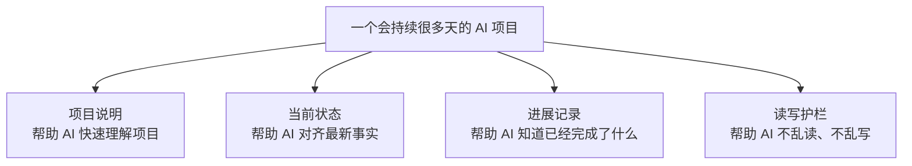
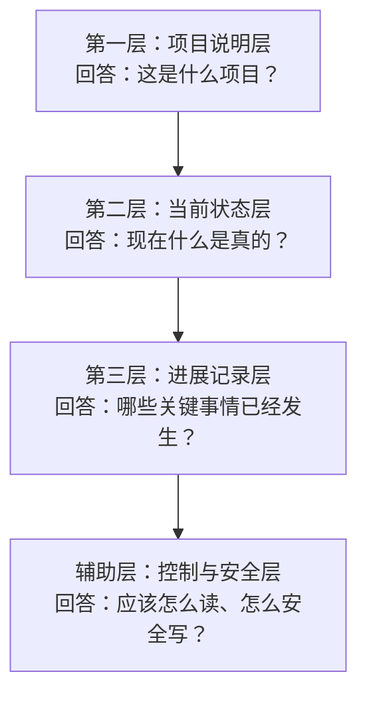
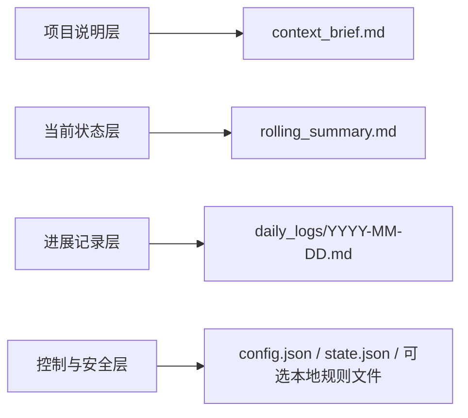
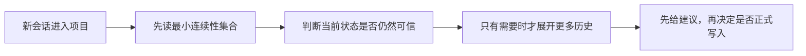

<div align="center">


<h1>🧶 ContextWeave</h1>

**一个长期项目，不该因为切模型、换 Agent、跨会话，就一次次重新开始。**

[](./skills/contextweave/package-metadata.json)
[](./LICENSE)
[](./skills/contextweave/package-metadata.json)

[English](./README.md) · **简体中文**

</div>

ContextWeave 把项目背景、当前真相、关键进展和下一步行动留在工作区里，让不同模型、不同 Agent、不同协作者都能接上同一个项目。

## 💡 为什么需要 ContextWeave？

如果你已经在混用 `Claude Code`、`Codex`、`Gemini CLI`、`Qwen Code`，甚至同一个项目里同时跑多个 Agent，你大概率已经遇到过这些问题：

- 换一个模型，就得重新解释一遍项目。
- 换一个 Agent，之前为什么这么做，很快就断掉了。
- 换一个平台，原来的 memory 带不走。
- 换一个协作者，没人知道“现在到底什么是真的”。
- 项目一旦做久，历史讨论、临时想法和当前结论就会越混越乱。

真正拖慢长期项目的，往往不是模型不够强，而是 **项目连续性不稳定**。

ContextWeave 不把连续性建立在单一聊天窗口，也不把项目真相托付给某个平台的私有黑盒 memory。它把一组轻量、显式、可审阅的连续性文件放回项目工作区本身，让接手项目的人或 Agent，都能更快回答四个核心问题：

- 🎯 **项目愿景**：这个项目到底是什么？
- 📍 **当前真相**：此时此刻，哪些事实是成立的？
- 🧗 **历史进展**：已经完成了哪些关键里程碑？
- 🚀 **下一步行动**：接下来最值得聚焦的是什么？

<p align="center">
  
</p>

## ✅ 你会直接得到什么

- **换模型时，不必从头重讲项目**：关键背景、当前状态、历史进展和下一步行动已经留在工作区里。
- **换 Agent 时，不必靠聊天记录接力**：项目当前真相不会只留在上一个窗口里。
- **换协作者时，也能更快接上项目**：不用先读完一长串代码 diff 或几十页对话，先看核心状态就能参与。
- **把“现在什么是真的”单独拎出来**：不再把历史讨论、临时想法和当前结论混成一团。
- **把长期项目从“靠人记住”变成“靠文件续上”**：谁来接手，先对齐真相，再继续推进。

## ✨ ContextWeave 的核心方式

- **🛡️ 文件原生**：连续性状态以普通 Markdown 和 JSON 落在工作区里，易于审阅、版本管理、迁移和恢复。
- **⚡ 节制的冷启动**：不是把全部历史一股脑塞给模型，而是优先读取最小连续性集合，再按任务需要扩展上下文。
- **🧠 分层保存信息**：稳定背景、当前状态、机器可读控制信息、历史里程碑分别存放，降低状态漂移。
- **🔒 推荐优先**：会给出恢复、工作日判断、下一步 review 建议，但不会在没有审阅的前提下偷偷改写项目状态。
- **🧪 写入护栏内建**：在需要正式写入时，会通过锁和校验机制帮助降低误写、乱写项目状态的风险。
- **📅 恢复与接续更完整**：支持工作日推荐、恢复提案与审阅记录，帮助长期项目更稳地继续推进。

## 🎯 更适合哪些人和哪些长期项目

当一个项目需要跨天、跨 Session、跨工具、跨模型或跨协作者继续推进时，ContextWeave 的价值会更明显。

<p align="center">
  
</p>

- **多平台、多模型混用的人**：如果你会在 `Claude Code`、`Codex`、`Gemini CLI`、`Qwen Code` 等工具之间切换，它可以减少“每换一个工具就重讲一遍”的成本。
- **使用多个 Agent 推进同一个项目的人**：如果你会并行跑 Agent，或者频繁把任务交给新的会话，它可以把项目当前真相稳定下来，而不是留在某一个窗口里。
- **非技术背景但在做长期协作的人**：研究、写作、产品、内容、运营等场景里，不是每个人都会读代码或聊天记录，但每个人都需要知道“现在项目进行到哪了”。
- **研究写作与文档协作**：让当前判断、证据线索、决策和下一步 focus 不容易漂移。
- **软件项目协调**：让实现状态、阻塞项、风险和下一步行动在跨会话协作中保持可见。
- **混合型长期项目**：如果一个项目同时包含写作、研究、产品、代码、运营等多种工作形态，通用连续性路径会是更安全的默认选择。

## 🗺️ 先把它理解成什么

第一次接触 ContextWeave 时，可以先不要记一堆内部术语。更容易理解的方式是：

> 它像是给一个长期项目准备的一本“谁来接手都能继续往下做的项目工作手册”。

这本手册里，最重要的不是花哨功能，而是四件事：

- **一页说明**：让 AI 知道“这个项目到底是什么”。
- **一页状态**：让 AI 知道“现在什么是真的”。
- **一组进展记录**：让 AI 知道“哪些关键事情真的发生过”。
- **一层读写护栏**：让 AI 知道“应该怎么读、什么时候该谨慎写”。



## 🧱 架构怎么分层

如果把它拆开来看，ContextWeave 本质上是在解决四个不同的问题：



| 层次 | 它回答的问题 | 读者会直接得到什么 |
|---|---|---|
| 项目说明层 | 这是什么项目？ | 新会话不需要重新追问背景 |
| 当前状态层 | 现在什么是真的？ | 更容易快速对齐最新事实 |
| 进展记录层 | 哪些关键事情已经发生？ | 更容易区分完成事项和讨论痕迹 |
| 控制与安全层 | 应该怎么读、怎么安全写？ | 恢复更稳，正式写入更谨慎 |

### 1. 项目说明层

这一层负责保存那些 **不会频繁变化，但又会不断影响后续判断** 的内容，例如项目目标、当前阶段、边界、约束和关键依据。

它解决的是：新会话接进来时，AI 不需要重新问一遍“我们到底在做什么”。

### 2. 当前状态层

这一层负责保存 **此时此刻最应该相信的当前判断**，例如当前成立的事实、当前风险、尚未解决的问题和下一步焦点。

它解决的是：AI 不需要在一堆历史对话里猜“现在最新状态到底是什么”。

### 3. 进展记录层

这一层负责保存 **真正发生过的关键进展**，而不是一闪而过的讨论痕迹。它更像项目的里程碑轨迹，而不是聊天记录备份。

它解决的是：AI 能分清“这是已经完成的事实”，还是“这只是之前讨论过的想法”。

### 4. 控制与安全层

这一层不是给人直接阅读的主内容，而是给工具和辅助脚本用来保证秩序的。它主要会帮助 Agent 做这四件事：

- **先读哪些内容**：避免一上来把所有历史全读一遍。
- **当前上下文是否足够新鲜**：降低基于旧状态继续工作的风险。
- **什么时候需要先 review 再写**：让正式更新更稳妥。
- **正式写入时怎样更谨慎**：降低把项目状态写乱的概率。

## 🗂️ 这些概念在文件里怎么落地

上面的四层，是给第一次接触者理解用的概念模型。它们在实际文件中的对应关系如下：



| 实际文件 | 作用 |
|---|---|
| `context_brief.md` | 保存项目的稳定背景和长期框架 |
| `rolling_summary.md` | 保存当前最应该对齐的状态快照 |
| `daily_logs/YYYY-MM-DD.md` | 按日期沉淀重要进展与里程碑证据 |
| `config.json`、`state.json` 与可选本地规则文件 | 帮助工具按顺序读取、谨慎写入，而不是让状态越写越乱 |

此外，ContextWeave 还提供了一块克制的伴生空间，主要用于承接 **恢复提案与审阅记录**。它的作用，是把这些中间材料和核心项目真相隔开，让恢复过程更清楚、更可审阅。

### 一眼看懂：项目里会留下什么

默认情况下，ContextWeave 会在项目里维护一小组连续性文件，而不是铺开一大堆零散缓存。

```text
PROJECT_ROOT/
├── your-project-files...
└── .contextweave/                  # 或 contextweave/
    ├── config.json
    ├── state.json
    ├── context_brief.md
    ├── rolling_summary.md
    ├── 本地规则文件                # 可选
    ├── daily_logs/
    │   └── YYYY-MM-DD.md
    └── companion/                 # 只在需要时出现
        └── recovery/
            ├── proposals/
            ├── review_log/
            └── archive/
```

可以把它理解成这样：

| 文件或目录 | 更容易理解的说法 |
|---|---|
| `context_brief.md` | 项目说明书，告诉 AI 这是什么项目。 |
| `rolling_summary.md` | 当前工作台，告诉 AI 现在什么是真的、下一步做什么。 |
| `daily_logs/` | 进展记录，告诉 AI 哪些关键事情已经真正发生过。 |
| `config.json` 与 `state.json` | 底层配置和状态，让工具读写更稳定。 |
| `companion/` | 恢复提案和审阅记录的独立区域，避免和核心项目真相混在一起。 |

如果你只是正常接入并持续使用，项目里看到的核心资产通常就是这一小组文件。

## 🔄 一个新会话是怎么接入项目的

ContextWeave 的重点，不是“把所有历史都读一遍”，而是“先读最小必要信息，再决定要不要展开”。



这也是它为什么能同时做到两件事：

- **冷启动更快**：新会话能更快进入状态。
- **后续写入更谨慎**：正式更新时更不容易写偏。

## 🏁 快速开始

如果你现在最关心的是“我今天怎么把它接进真实项目”，可以直接按下面走，不用先看完全部文档。

### 第一步：先选一种最适合你的接入方式

#### 方式 A：我想最快试一下

如果当前环境支持 [skills.sh](https://skills.sh/docs/cli) 这类开放 Skills CLI，最短路径是直接安装：

```bash
npx skills add https://github.com/Frappucc1no/contextweave --skill contextweave
```

适合：

- 想先快速试用的人
- 已经在 Skills CLI 生态里工作的人
- 想先跑起来，再决定要不要长期接入的人

#### 方式 B：我想在现有 AI 工具里长期使用

如果当前工具采用目录式 skills，把 installable skill 目录接入对应的 skills 目录即可。不要只复制 `SKILL.md`。

```bash
cp -R /path/to/contextweave/skills/contextweave /path/to/<skills-dir>/contextweave

# 或
ln -s /absolute/path/to/contextweave/skills/contextweave /path/to/<skills-dir>/contextweave
```

适合：

- 想在 `Codex`、`Claude Code`、其他支持目录式 skills 的工具里长期使用的人
- 想把它变成项目级默认能力的人
- 想跨多个工具复用同一套连续性文件的人

### 如果你不知道该选哪种

默认建议：

- **想先试用**：选方式 A
- **想直接在真实项目里长期用**：选方式 B
- **想跨多个工具复用同一套连续性状态**：优先选项目级或目录式接入

### 常见环境怎么接

| 环境 | 推荐接法 | 什么时候最合适 |
|---|---|---|
| Skills CLI 生态 | `npx skills add https://github.com/Frappucc1no/contextweave --skill contextweave` | 想最快装好开始试的人 |
| Codex | 接入 `.agents/skills/contextweave` | 想在项目内长期协作、做项目级接入的人 |
| Claude Code | 接入 `~/.claude/skills/contextweave` 或 `.claude/skills/contextweave` | 想做用户级或项目级接入的人 |
| 其他支持目录式 Skills 的工具 | 将整个目录接入该工具的 skills 目录 | 想跨工具复用同一套连续性文件的人 |

### 第二步：不要空装，马上接一个真实项目

安装好之后，最值得做的不是继续看说明，而是：

> 找一个你真的会反复继续的项目，把它接起来。

因为只有接进真实项目，你才会立刻感觉到它解决的是不是你的痛点。

#### 第 1 步：初始化项目

如果你已经在安装好的 `contextweave/` 包目录里，或者正在 source checkout 的 `skills/contextweave/` 目录里，可以直接运行：

```bash
python3.13 scripts/init_context.py /absolute/path/to/project
python3.13 scripts/validate_context.py /absolute/path/to/project --json
```

#### 第 2 步：确认接入成功

如果你的环境不是 `python3.13`，替换为任意可用的 Python `3.10+` 即可。

> 当 `validate_context.py` 返回 `"valid": true` 后，这个项目就已经接入完成。

#### 第 3 步：回到 AI 工具里，直接开始说人话

接下来不要先研究命令细节，直接用自然语言开始即可，例如：

| 你可以直接说 | 适合什么时候用 |
|---|---|
| `continue this project` | 已经有连续性文件，准备继续推进时 |
| `restore project context` | 想先恢复上下文、再决定下一步时 |
| `pick up where we left off` | 跨会话回来继续同一个任务时 |
| `record today's progress` | 想把今天的重要进展沉淀下来时 |

### 然后：如果你想更稳地长期使用

等你第一次在真实项目里跑通之后，再回来看这些会更有感觉：

- 想按你的工作类型选默认工作方式：看 [skills/contextweave/profiles/](./skills/contextweave/profiles/)
- 想知道辅助运行时怎么配合：看 [USAGE.md](./USAGE.md)
- 想确认文件契约和状态结构：看 [skills/contextweave/references/file-contracts.md](./skills/contextweave/references/file-contracts.md)

<details>
  <summary><strong>查看 Codex 项目级接入示例</strong></summary>

```bash
mkdir -p .agents/skills
ln -s /absolute/path/to/contextweave/skills/contextweave .agents/skills/contextweave
```

</details>

<details>
  <summary><strong>查看 Claude Code 用户级接入示例</strong></summary>

```bash
mkdir -p ~/.claude/skills/contextweave
rsync -a /absolute/path/to/contextweave/skills/contextweave/ ~/.claude/skills/contextweave/
```

</details>

### 一个简单但实用的判断方法

如果你现在还不确定要不要长期用，最好的判断方法不是继续读更多介绍，而是：

1. 选一个你已经做到一半的项目。
2. 接入 ContextWeave。
3. 隔一天，或者换一个 Agent / 模型，再回来继续。

如果那时候你明显感觉到：

- 不用重新讲背景
- 不用翻半天聊天记录
- 当前状态更容易对齐
- 别人也更容易接手

那它对你就是有价值的。

### 如果更新后出现异常

可以先移除，再重新安装：

```bash
npx skills remove contextweave
npx skills add https://github.com/Frappucc1no/contextweave --skill contextweave
```

## ❓ FAQ

<details>
  <summary><strong>它会不会自动改我的项目代码？</strong></summary>
  <p>不会把你的业务代码当成默认目标去静默接管。它主要围绕连续性文件工作；当需要正式写入时，也会强调明确触发、先判断、再落盘。</p>
</details>

<details>
  <summary><strong>我已经有一个进行中的项目了，还能中途接入吗？</strong></summary>
  <p>可以。这正是它很适合的场景之一：把一个已经推进中的项目整理出稳定背景、当前状态和关键进展，让后续会话更容易继续。</p>
</details>

<details>
  <summary><strong>它只适合编程项目吗？</strong></summary>
  <p>不是。它同样适合研究写作、产品文档协作、软件项目协调，以及这几类之外的混合型长期项目。如果一个项目暂时不明显属于某个专用场景，通用连续性路径就是更安全的默认选择。</p>
</details>

<details>
  <summary><strong>我是不是每天都要维护很多文件？</strong></summary>
  <p>不需要。它强调的是最小必要连续性集合，而不是把每次对话都变成文档劳动。真正长期有价值的状态，才值得留下。</p>
</details>

<details>
  <summary><strong>它会在项目里留下很多东西吗？</strong></summary>
  <p>通常不会。核心就是一小组连续性文件，再加上按日期组织的进展记录。恢复提案、审阅记录这类材料也会被单独隔离，避免把项目目录弄乱。</p>
</details>

<details>
  <summary><strong>我必须绑定某个 AI 工具才能使用吗？</strong></summary>
  <p>不需要。ContextWeave 的思路本身是文件原生的。只要工具支持安装这类技能包，并能读取项目文件，它就更容易跨工具延续同一个项目状态。</p>
</details>

## 🌟 当前版本亮点

- **工作日推荐**：帮助 Agent 判断更适合继续哪一天的工作，减少跨天续写时的混乱。
- **恢复提案与审阅记录**：让历史恢复过程更清楚，也更适合团队协作与人工把关。
- **更稳的冷启动**：优先读取最小必要信息，让新会话更快进入状态。
- **更清晰的文件资产管理**：让连续性文件、恢复材料和辅助记录各归其位，保持项目结构整洁。
- **更可靠的正式写入保护**：在需要落盘时提供更谨慎的护栏，降低把项目状态写乱的风险。

## 📚 进阶阅读与核心规范

当你的项目接入 ContextWeave 后，如果你想深入了解它的读写契约或参与二次开发，请查阅以下核心文档：

- 🤖 [**SKILL.md**](./skills/contextweave/SKILL.md)：想看 Agent 如何进入 ContextWeave、选择合适 profile，并把它真正用起来时。
- 📖 [**USAGE.md**](./USAGE.md)：想查看辅助运行时怎么用、什么时候需要人工介入时。
- 🔐 [**references/file-contracts.md**](./skills/contextweave/references/file-contracts.md)：想确认什么样的状态更新才算合法、可接受时。

## 📄 开源协议

本项目基于 Apache License 2.0 协议开源。详见 [LICENSE](./LICENSE) 与 [NOTICE](./NOTICE)。
