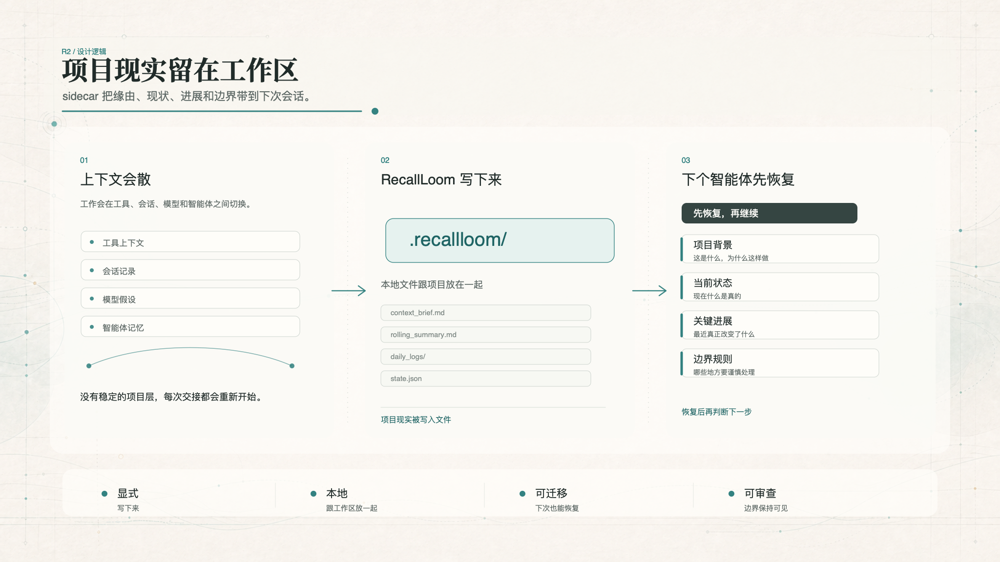
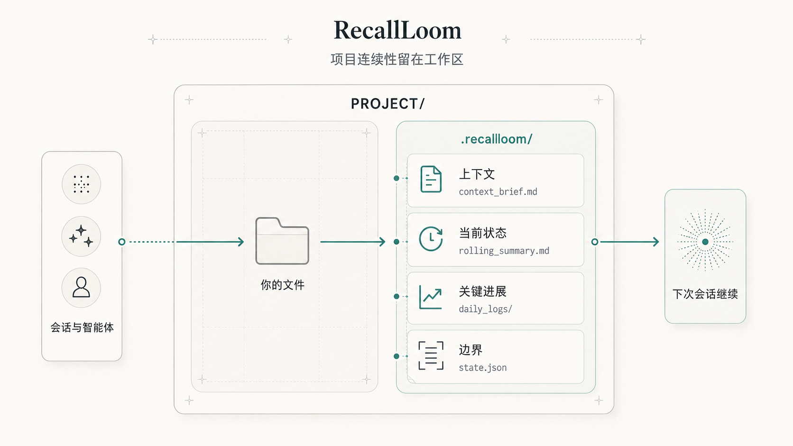

<div align="center">

<h1>🧶 RecallLoom</h1>

**让项目自己记住自己。**

**为跨智能体、跨会话、跨模型持续推进的项目准备的连续性层。**

[](./skills/recallloom/package-metadata.json)
[](./LICENSE)
[](./skills/recallloom/package-metadata.json)

[English](./README.md) · **简体中文**

</div>

<p align="center">
  
</p>

如果你每次切到新的受支持的编码智能体、基于目录安装的工具或新会话，都要先花十分钟重新解释项目，那你真正缺的通常不是更聪明的模型，而是一层不会丢的 **项目连续性**。

RecallLoom 把项目为什么存在、现在什么是真的、最近推进到哪里、下一步该怎么接上，留在项目本身，而不是锁在某个平台的私有记忆里。它不是另一个后台，不是平台私有记忆，也不是替你静默读懂整个仓库的黑盒；它做的事情更克制：把长期项目真正需要保留下来的项目现实留在工作区里，让下一个会话能直接接上。

**快速跳转：** [它解决什么问题](#problem) · [谁最适合使用](#fit) · [快速开始](#quick-start) · [内置场景模式](#modes) · [FAQ](#faq)

<a id="problem"></a>
## 💥 它解决什么问题

如果你已经在混用不同工具、模型和会话，这些问题应该很熟：

- 每换一个工具，就要再付一遍“重启税”。
- 新会话知道仓库里“有什么”，却不知道“为什么会变成这样”。
- 新智能体进来时，很难判断“现在到底什么是真的”。
- 项目一做久，历史讨论和当前结论就很容易混在一起。

真正拖慢长期 AI 工作的，很多时候不是模型不够强，而是 **项目连续性总在中断**。

RecallLoom 做的事情很克制：它不试图凭空理解一切，而是把你已经沉淀出来、而且确实值得长期保留的项目现实留在工作区里。

<p align="center">
  
</p>

## 🧭 它怎么工作

RecallLoom 在项目里保留的是一套小而清楚的连续性结构。它不把所有历史堆成一团，而是把最该长期保留的项目现实拆成 4 个部分：

- **项目背景**：这个项目是什么，为什么会这样做。
- **当前状态**：现在进行到哪，哪些判断仍然有效。
- **关键进展**：最近真正发生了什么，哪些决定值得回看。
- **规则与边界**：哪些地方要谨慎读，哪些地方不能随便改。

新会话不需要先吞下全部历史。先恢复这 4 层项目现实，再决定下一步怎么接上。首次接入也不是把项目交给静默黑盒“自动总结完”；更稳妥的路径，是先恢复这 4 层项目现实，再继续推进。

在初始化、恢复和写入时，RecallLoom 会优先确认 sidecar、运行环境和当前状态是否可信；只有需要沉淀长期事实时，才通过带有修订检查和新鲜度提示的辅助脚本更新连续性文件。

<p align="center">
  
</p>

<a id="fit"></a>
## 🎯 谁最适合使用

最容易立刻感受到价值的是：

- **已经习惯让 AI 参与真实项目的人**：尤其是个人开发者和超小团队，会反复把同一个项目交给不同会话、不同模型、不同智能体继续推进。
- **经常在受支持的编码智能体和基于目录安装的工具之间切换的人**：不想每换一次工具就重讲一遍项目。
- **研究写作、产品文档、软件项目协调**：这些工作都特别依赖项目缘由、决策、进展和下一步不要漂掉。

典型高价值场景也很集中：

- **跨天回来继续**：隔了一天、一周、甚至更久，再次进入项目时，不必先靠聊天记录重建世界。
- **跨模型或跨智能体接力**：今天用 Claude，明天换 Codex、Gemini CLI 或另一个智能体，项目状态不会跟着丢。
- **长期研究 / PRD / 软件协调**：最怕“当前真相”和“历史脉络”被冲散的工作。

如果你只是一次性问答、临时聊天，或者根本不会回到同一个项目，RecallLoom 带来的收益会有限。

<a id="modes"></a>
## 🧩 内置场景模式

RecallLoom 内置了 4 种场景模式，对应 4 类常见项目形态。研究写作、产品文档、软件协调这类特征明确的项目，会进入对应模式；混合型项目或边界还不够清楚的项目，会先落在通用模式。

| 模式 | 最适合什么项目 | 它主要帮你稳住什么 |
|---|---|---|
| 通用模式 | 项目同时混合研究、写作、产品、代码或运营工作 | 整体项目现实，不会过早把项目理解窄了 |
| 研究写作模式 | 以来源、论点、证据和长文写作为主的工作 | 论点、证据和写作进展 |
| 产品文档模式 | 以 PRD、RFC、策略文档和利益相关者对齐为主的工作 | 范围、决策和待定问题 |
| 软件协调模式 | 以工程规划、仓库执行和实现推进为主的工作 | 状态、阻塞项和下一步行动 |

安装后，常见的自然语言触发语包括：

- `继续这个项目`
- `恢复项目上下文`
- `从上次停下的地方继续`
- `记录今天的关键进展`

## ✨ 它为什么有用，但又不会变得很重

RecallLoom 的关键，不是“多记东西”，而是只把真正长期有价值的项目现实拆开保存，而不是混成一份越来越长的大笔记。

| 这本“项目手册”的部分 | 它帮下一次进入项目的人恢复什么 |
|---|---|
| 项目背景 | 这个项目是什么，应该怎么理解它 |
| 当前状态 | 现在什么是真的 |
| 关键进展 | 真正发生过什么，而不只是讨论过什么 |
| 规则与边界 | 什么时候该谨慎读，什么时候该谨慎写 |

所以，新会话不需要先把所有历史全读一遍，先给它一个更小、更稳的起点就够了。

## 🧱 这些选择是故意的

- **不污染项目主体**：连续性状态放在 sidecar，而不是硬塞进你原本的代码、文档和目录里。
- **不假装全懂整个仓库**：它聚焦恢复项目背景、当前状态、关键进展和边界，而不是冒充全仓理解器。
- **默认先走最短可信路径**：先把最关键的项目现实接上；只有在来源冲突、材料不足、风险更高，或你明确要求更深一层审查时，才升级到更重的路径。
- **宿主 memory 不是默认事实源**：如果启用了宿主侧 memory，它也只是显式、可选、只作提示的辅助输入，不会静默盖过工作区里的项目现实。
- **先追求可信，再追求自动**：它宁可先把项目现实讲清楚，也不愿意先把项目交给一个边界含糊的黑盒系统。

<details>
  <summary><strong>查看它在项目里是怎么落地的</strong></summary>

| 更好懂的叫法 | 项目里的对应文件 |
|---|---|
| 项目背景 | `context_brief.md` |
| 当前状态 | `rolling_summary.md` |
| 关键进展 | `daily_logs/YYYY-MM-DD.md` |
| 规则与边界 | `config.json`、`state.json`、可选 `update_protocol.md` |

```text
PROJECT_ROOT/
├── your-project-files...
└── .recallloom/                    # 或 recallloom/
    ├── context_brief.md
    ├── rolling_summary.md
    ├── daily_logs/
    ├── config.json
    ├── state.json
    ├── update_protocol.md          # 可选
    └── companion/                  # 只在需要时出现
```

</details>

<a id="quick-start"></a>
## 🚀 快速开始

第一次接入，不需要先背专门命令。按这 4 步走就够了：

1. 把技能包安装到本机
2. 第一次在对话里明确唤起 RecallLoom
3. 如果项目还没接入，就确认初始化；在支持稳定动作名的宿主里，也可以直接输入 `rl-init`
4. 然后正常推进项目

### 第一步：安装技能包

#### 方式 A：使用 Skills CLI

如果你的环境支持 [skills.sh](https://skills.sh/docs/cli) 这类 Skills CLI，可以直接从仓库安装：

```bash
npx skills add https://github.com/Frappucc1no/recall-loom --skill recallloom
```

v0.3.5 让项目恢复更快、进展记录更结构化，也让托管更新在真正写入前更容易预览。

之后需要更新已安装技能时，使用：

```bash
npx skills update
```

#### 方式 B：目录式安装

如果当前工具支持目录式技能包，就把整个包目录接入对应的技能目录：

```bash
cp -R /path/to/recall-loom/skills/recallloom /path/to/<skills-dir>/recallloom

# 或
ln -s /absolute/path/to/recall-loom/skills/recallloom /path/to/<skills-dir>/recallloom
```

### 第二步：第一次显式唤起 RecallLoom

第一次使用时，先在对话里明确唤起 RecallLoom。

常见做法：

- 用宿主的技能选择器找到 `recallloom`
- 用 `@recallloom`
- 或直接说：`请用 RecallLoom 接管这个项目`

### 第三步：用户确认；需要时再用 `rl-init`

如果 agent 判断当前项目还没初始化，你只需要：

- 直接确认
- 或直接输入：`rl-init`

它会完成初始化、校验，并给出下一步建议。

如果当前环境拿不到兼容的 Python `3.10+`，正确做法是明确报阻塞，而不是手工拼出 `.recallloom/` 或 `recallloom/`。

### 第四步：正常推进项目

初始化完成后，就按平时推进项目。常用说法：

| 你可以说 | 最适合什么时候 |
|---|---|
| `继续这个项目` | 项目已经有连续性文件，准备继续推进时 |
| `先帮我恢复项目上下文` | 想先恢复上下文，再决定下一步时 |
| `从上次停下的地方继续` | 跨会话回来继续同一项工作时 |
| `记录今天的关键进展` | 想把重要进展沉淀进连续性文件时 |

项目初始化后，下次回来时可以直接说“继续这个项目”“先帮我恢复项目上下文”或“从上次停下的地方继续”。RecallLoom 会先读取已有连续性文件，恢复背景、当前状态和下一步；只有在连续性文件缺失、冲突、明显不足，或你明确要求更深入审查时，才需要扩大到更完整的项目检查。

如果你的工具支持稳定动作名，也可以用 `rl-resume` 明确触发恢复；多数时候，直接用自然语言说明要继续项目就够了。

只有当宿主 / router 遵守 RecallLoom 的 restore contract 时，这类通用表达才会直接路由到 RecallLoom；否则请先显式唤起 RecallLoom 或直接使用 `rl-resume`。

更偏操作员的入口也在同一个 dispatcher 里：`quick-summary` 用于低延迟恢复快照，`append --entry-json` 用于结构化追加 daily log，`write --type ... --dry-run` 用于先预览再安全写入。这些是现有 `v0.3.4` 项目的可选采用路径；sidecar protocol 仍保持 `1.0`。

如果想了解更偏操作员视角的命令入口和 helper 操作流，见 [USAGE.md](./USAGE.md)。

## 📦 技能包结构

下面是安装和集成细节：

<details>
  <summary><strong>查看包的基本形态</strong></summary>

```text
recallloom/
├── SKILL.md
├── managed-assets.json
├── profiles/
├── references/
├── scripts/
├── native_commands/
├── package-metadata.json
└── ...
```

| 组成部分 | 作用 |
|---|---|
| `SKILL.md` | 给 AI 工具读取的主入口文件 |
| `managed-assets.json` | packaged helpers 使用的必需 managed asset 注册表 |
| `profiles/` | 面向不同项目形态的默认模式 |
| `references/` | 协议细节、文件契约和操作说明 |
| `scripts/` | 用于统一入口、初始化、校验、状态、bridge 和护栏写入的辅助脚本 |
| `native_commands/` | 面向支持宿主的可选原生命令模板 |
| `package-metadata.json` | 版本与能力元信息 |

</details>

<details>
  <summary><strong>查看版本信息与运行前提</strong></summary>

### 版本信息

<!-- RecallLoom metadata sync start: package-metadata -->
- 包版本：`0.3.5`
- 协议版本：`1.0`
- 当前支持的协议版本：
  - `1.0`
<!-- RecallLoom metadata sync end: package-metadata -->

### 更新记录

<details>
  <summary><strong>v0.3.5</strong></summary>

- 通过更紧凑的当前状态快照，更快恢复已有项目；需要时再深入读取更多上下文。
- 用结构化追加记录里程碑进展，并保持每个日进展文件内的条目顺序清晰。
- 在写入前预览托管更新，让项目背景、当前状态和日进展写入更稳妥。
- 现有 RecallLoom 项目无需迁移连续性文件；协议兼容性保持 `1.0`。

</details>

<details>
  <summary><strong>v0.3.4</strong></summary>

- 提升跨天继续体验：未收尾的活跃工作可以更自然地延续到下一次会话，读侧状态说明也更一致。
- 拆清信任与失败信号：结构可信度、内容新鲜度、漂移风险、工作日状态和包支持状态分开呈现，避免用一个模糊信号覆盖所有情况。
- 增加轻量包支持检查：已安装包可按日读取支持建议；需要升级时，高风险动作会明确阻断，普通网络失败不会直接中断正常工作。
- 强化分层写入判断：更清楚地区分哪些内容适合进入项目背景、当前状态、日进展或不应写入，并保留“暂缓、确认后写入、拆分到多层”等安全判断。
- 加固时间一致性：未来日期、跨日延续和手动指定日期进入同一套审查规则，降低错误时间线污染连续性文件的风险。

</details>

<details>
  <summary><strong>v0.3.3</strong></summary>

- 收紧首次初始化边界：初始化必须走标准辅助流程；环境缺失时明确报告阻塞，不鼓励手工拼出连续性文件。
- 已初始化项目的恢复路径更稳：继续 / 恢复类请求优先读取已有连续性文件，减少不必要的宽泛探索。
- 降低普通用户交互里的术语负担，并补齐中文入口与跨工具入口文档的稳定性。
- 改善连续性写回体验，减少需要用户处理临时中转文本的情况。

</details>

<details>
  <summary><strong>v0.3.2</strong></summary>

- 引入可信冷启动：已有项目首次接入时先生成可审阅的项目现实提案，而不是直接把空模板当成完成态。
- 推进协议事实单源化：用 registry、schema 和文档同步检查降低代码、协议和说明之间的漂移。
- 拆清核心模块边界：把协议、工作区运行时、新鲜度、桥接安全等能力从单一大模块里分离出来。
- 补齐中文查询、路径识别、wrapper 路径和首用可信度等公开可用性缺口。

</details>

<details>
  <summary><strong>v0.3.1</strong></summary>

- 固定 `rl-init` 作为首次接入的标准动作，把初始化、校验和下一步建议收成一个入口。
- 新增统一 dispatcher，让 agent 和操作员不必记住多个底层脚本。
- 增加可选原生命令包装模板，方便在支持宿主中承接同一套动作语义。
- README、USAGE、SKILL 和适配说明从“脚本说明”转向“技能包接入流程”。

</details>

<details>
  <summary><strong>v0.3.0</strong></summary>

- 新增只读连续性查询能力，支持按问题召回项目背景、当前状态、引用依据、新鲜度和冲突提示。
- 统一状态检查、预检和查询路径的读侧基线，让新会话更容易从同一套项目现实开始。
- 修复项目本地规则文件的安全提交路径，并建立最小自动化测试底座。
- 增加连续性文本附着前的安全扫描，降低桥接文本带来的误导风险。

</details>

<details>
  <summary><strong>v0.2.2</strong></summary>

- 完成从早期 ContextWeave 命名到 RecallLoom 的公开品牌切换。
- 将可安装技能包迁移到 `skills/recallloom/`，并让公开 README、元数据和安装路径对齐。
- 将默认连续性路径切到 `.recallloom/`，使产品名称、包路径和运行时表面保持一致。

</details>

<details>
  <summary><strong>0.2.1</strong></summary>

- 强化早期公开 README、中文 README 和安装说明。
- 增加通用项目连续性模式，让混合型长期项目不必被过早归入研究、产品或软件单一形态。
- 补充早期视觉资产和更清晰的项目适配说明。

</details>

<details>
  <summary><strong>0.1.0</strong></summary>

- 建立最早的文件原生连续性包：项目背景、当前状态、日进展、配置状态和本地规则文件。
- 提供初始化、校验、预检、桥接、归档、写锁和修订感知写入等基础辅助脚本。
- 固定协议 `1.0` 的早期文件模型与 Python `3.10+` 运行前提。

</details>

### 运行前提

<!-- RecallLoom metadata sync start: runtime-assumptions -->
- Python 版本要求：`3.10` 及以上
- 支持的工作区语言：
  - `en`
  - `zh-CN`
- 支持的入口桥接文件：
  - `AGENTS.md`
  - `CLAUDE.md`
  - `GEMINI.md`
  - `.github/copilot-instructions.md`
<!-- RecallLoom metadata sync end: runtime-assumptions -->

</details>

<details>
  <summary><strong>查看常见安装位置</strong></summary>

| 环境 | 推荐接法 | 最适合什么时候 |
|---|---|---|
| Skills CLI 生态 | 使用 `npx skills add ... --skill recallloom` 安装；用 `npx skills update` 更新 | 想用统一的技能安装与更新流程时 |
| Codex | 接入 `.agents/skills/recallloom` | 想在仓库内做项目级长期协作 |
| 受支持的基于目录安装的编码智能体 | 把整个目录接入该智能体的技能文件夹 | 想做用户级或项目级安装 |
| 其他目录式工具 | 把整个目录接入该工具的技能文件夹 | 想跨工具复用同一套连续性文件 |

</details>

<a id="faq"></a>
## ❓ FAQ

<details>
  <summary><strong>它会自动改我的项目代码吗？</strong></summary>
  <p>不会。它的主要关注点是连续性层本身；正式写入应该通过明确触发和更安全的更新路径发生。</p>
</details>

<details>
  <summary><strong>如果几乎没有聊天记录或项目沉淀，它也能自动读懂整个项目吗？</strong></summary>
  <p>不能。RecallLoom 不是零上下文的全仓扫描理解器。它最擅长的是把已经沉淀出来的项目背景、当前状态、关键进展和规则边界稳定保留下来，让下一个会话更容易接上；如果项目本身几乎没有留下这些信号，它也不可能凭空补出完整现实。</p>
</details>

<details>
  <summary><strong>它会一直在后台静默运行吗？</strong></summary>
  <p>不是后台常驻服务。它更适合在关键节点介入，例如“继续这个项目”“恢复项目上下文”“记录今天的关键进展”。准备交接、结束一天工作、或刚完成关键决策时，让它介入会特别有价值。</p>
</details>

<details>
  <summary><strong>我可以把它接到一个已经在推进中的项目里吗？</strong></summary>
  <p>可以，而且很多人第一次用它，就是在一个已经在推进中的项目里。把稳定背景、当前状态和关键进展补进去，后续会话就更容易继续。</p>
</details>

<details>
  <summary><strong>它只适合编程项目吗？</strong></summary>
  <p>不只适合编程项目。它同样适合研究写作、产品文档协作、软件项目协调，以及混合型长期项目。项目特征明确时，会进入对应模式；边界还不够清楚时，先用通用模式。</p>
</details>

<details>
  <summary><strong>我是不是每天都要维护很多文件？</strong></summary>
  <p>不需要。它强调的是最小必要连续性集合，而不是把每次会话都变成文档劳动。只有真正长期有价值的状态才值得留下。</p>
</details>

<details>
  <summary><strong>为什么要用 sidecar，而不是直接写进项目正文里？</strong></summary>
  <p>因为这是一个故意的设计选择。sidecar 能把连续性状态留在项目旁边，又尽量不污染你原本的代码、文档和目录结构。这样它既能跟着项目走，又不会强行侵入项目主体。</p>
</details>

如果这个项目对你有帮助，欢迎点一个 Star，也欢迎把它转给更多有类似需求的人。

## 🙏 致谢

感谢 [Linux.do](https://linux.do) 社区，也欢迎在那里交流使用体验和改进建议。

## 📚 延伸阅读

- [SKILL.md](./skills/recallloom/SKILL.md)
- [USAGE.md](./USAGE.md)
- [profiles/](./skills/recallloom/profiles/)
- [file-contracts.md](./skills/recallloom/references/file-contracts.md)
- [package-support-policy.md](./skills/recallloom/references/package-support-policy.md)
- [protocol.md](./skills/recallloom/references/protocol.md)

## 📄 开源协议

本项目基于 Apache License 2.0 协议开源。详见 [LICENSE](./LICENSE) 与 [NOTICE](./NOTICE)。
