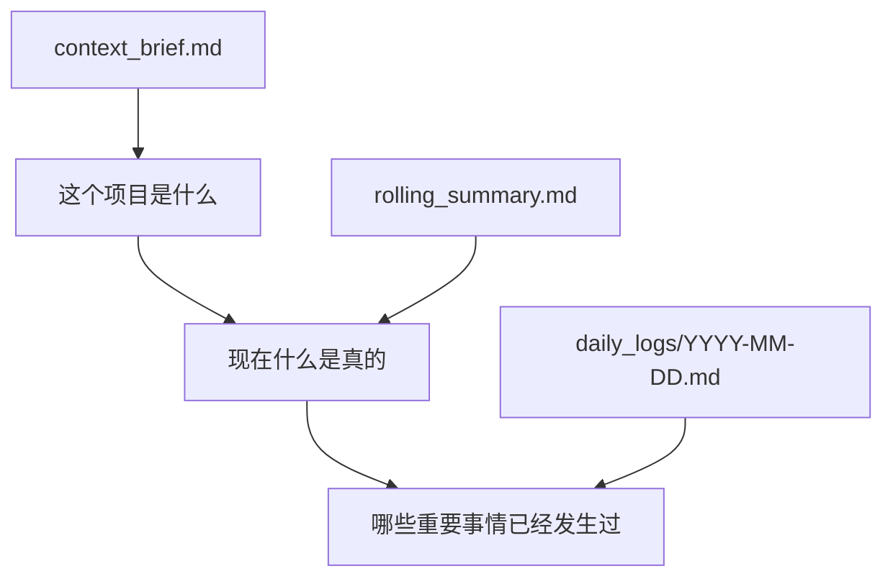
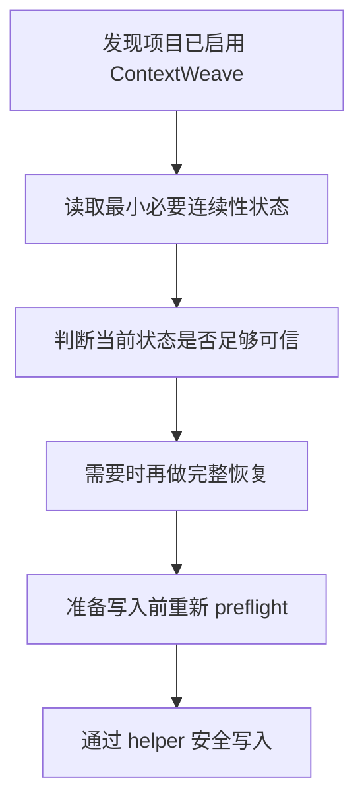

# ContextWeave

> 🧭 让 AI 在长周期项目里更稳定地继续工作。
>
> `ContextWeave` 是一个面向项目连续性的轻量 skill：
> 用一组清晰、可审计的项目文件，把“项目背景”“当前状态”“关键进展”固定下来，让下一次继续不再从头对齐。

[English](./README.md) · 简体中文

[](./LICENSE)
[](./package-metadata.json)
[](./package-metadata.json)
[](./package-metadata.json)

**关键词：** AI Agent、项目连续性、跨会话记忆、项目状态管理、project continuity、session continuity、context harness

## ✨ 为什么值得关注

很多 AI 工作流在第一次开始时看起来很好，但只要项目跨到第二天、第三天，问题就会变得很明显：

- 又要重新解释项目背景
- 当前状态和历史过程越积越乱
- 不同会话、不同工具、不同 agent 对“项目现在到哪一步了”形成不同理解
- 重要结论讨论过了，却没有被正式固定下来

`ContextWeave` 解决的就是这类问题。

它不追求“记住所有内容”，而是只固定真正关键的项目状态，让 AI 在继续同一个项目时，仍然能快速知道：

- 这个项目是什么
- 现在什么是真的
- 已经发生过哪些关键进展
- 接下来最值得做什么

## 🚀 你会得到什么

- **更少重复解释**：跨会话继续时，不必反复讲背景
- **更稳定的当前状态**：项目介绍、当前状态、里程碑证据分层保存
- **更低的漂移风险**：不同工具和不同 agent 更容易对齐到同一个项目状态
- **更正式的连续性边界**：不仅有文件，还有状态、恢复路径和写入门禁
- **更强的可审计性**：连续性状态保留在项目文件里，而不是锁在某个平台私有记忆里

## 🎯 适合什么项目

`ContextWeave` 更适合以下类型的工作：

- 一个项目会持续几天、几周甚至更久
- 你经常切换会话、工具或 agent
- 项目里需要持续判断“现在什么是真的”
- 你不希望项目连续性只依赖会话窗口里的临时上下文

当前更贴近的三类典型场景是：

- 研究写作
- 产品文档协作
- 软件项目协调与持续推进

## 🏁 快速开始

### 推荐方式：支持 Skills CLI 的环境

如果当前环境支持 [skills.sh](https://skills.sh/docs/cli) 这类开放 Skills CLI，可以直接安装：

```bash
npx skills add https://github.com/Frappucc1no/contextweave
```

### 通用方式：目录式接入

如果当前工具采用目录式 skills，直接把整个仓库目录接入对应的 skills 目录即可。不要只复制 `SKILL.md`。

```bash
cp -R /path/to/contextweave /path/to/<skills-dir>/contextweave

# 或
ln -s /absolute/path/to/contextweave /path/to/<skills-dir>/contextweave
```

### 常见环境

| 环境 | 接入方式 |
|---|---|
| Skills CLI 生态 | `npx skills add https://github.com/Frappucc1no/contextweave` |
| Codex | 接入 `.agents/skills/contextweave` |
| Claude Code | 接入 `~/.claude/skills/contextweave` 或 `.claude/skills/contextweave` |
| 其他目录式环境 | 将整个目录接入该工具的 skills 目录 |

Codex 项目级接入示例：

```bash
mkdir -p .agents/skills
ln -s /absolute/path/to/contextweave .agents/skills/contextweave
```

Claude Code 用户级接入示例：

```bash
mkdir -p ~/.claude/skills/contextweave
rsync -a /absolute/path/to/contextweave/ ~/.claude/skills/contextweave/
```

## 🧠 它为什么更接近 harness 范式

如果只把问题理解为“上下文如何组织”，重点通常会放在：

- prompt 怎么组织
- 当前会话里给模型什么信息
- memory 怎么裁剪或追加

`ContextWeave` 处理的是更靠后的问题：

> 当一个项目会跨几天、几周持续推进时，如何让 AI 的工作状态稳定存在，而不是每次重新拼装一轮上下文。

这也是它更接近轻量 harness 的原因。这里的 `harness` 不是重型代理平台，而是一个具备最小系统性的连续性层。

当前已经具备三类典型特征：

### 1. 正式状态面

项目连续性不是只留在会话里，而是有明确状态文件与机器可读 contract，例如：

- `config.json`
- `state.json`
- managed file markers

### 2. 恢复路径

它不是“读几份文件试试看”，而是围绕恢复形成一条清晰链路：

- 发现项目是否启用连续性系统
- 读取最小必要状态
- 判断当前状态是否可信
- 必要时再完整恢复

### 3. 写入门禁

当前 `0.1.0` 已经包含：

- revision-aware helper
- write lock
- atomic replace
- rollback / fail-closed 倾向

因此它不只是文档模板，而更像一个以 skill 形态交付的轻量项目连续性 harness。

## 📌 一个常见使用场景

假设你正在推进一份 PRD、研究项目或软件改造任务：

- 第一天，你和 AI 梳理方向和关键判断
- 第二天，你回来继续推进，不想再从头讲背景
- 第三天，你换了一个工具继续工作
- 第四天，你只想快速知道“现在什么是真的、下一步该做什么”

`ContextWeave` 在这里做的事情很具体：

- 用一份文件固定项目的稳定 framing
- 用一份文件固定当前状态
- 用按日期组织的方式保留重要里程碑

这样后续继续工作时，AI 是在一个已经存在的项目状态上推进，而不是重新猜测项目。

## 🗂️ 一眼看懂核心结构

`ContextWeave` 把项目连续性拆成三层：



### `context_brief.md`

固定稳定 framing，例如：

- 项目目标
- 当前阶段
- source of truth
- 关键边界与约束

### `rolling_summary.md`

固定当前状态，例如：

- 当前成立的事实
- 当前稳定判断
- 风险与未决问题
- 下一步

### `daily_logs/YYYY-MM-DD.md`

保留里程碑证据，例如：

- 已完成工作
- 关键决定
- 已确认事实
- 阻塞与建议下一步

## 🔒 它为什么不只是“几份项目文件”

`ContextWeave` 虽然是文件驱动的，但它并不是“手工维护几份 markdown”这么简单。  
当前 `0.1.0` 已经包含：

- `config.json`：工作区配置真源
- `state.json`：机器状态真源
- machine-readable contract
- revision-aware commit / append helper
- project-scoped write lock
- rollback / fail-closed 倾向

这意味着它已经不只是文档模板，而是一个带正式边界的连续性系统。

## 📦 仓库结构

这个仓库本身就是 skill 包根目录：

```text
contextweave/
├── SKILL.md
├── README.md
├── USAGE.md
├── package-metadata.json
├── profiles/
├── references/
├── scripts/
├── LICENSE
└── NOTICE
```

安装和分发时，应将整个目录作为一个 skill 包处理。

## 🔄 它如何帮助 AI 持续不跑偏



它解决的不是“怎么再多写几份项目文件”，而是：

- 先恢复
- 再判断
- 真正写入前再过安全门

## 🧩 它和平台原生记忆能力的关系

`ContextWeave` 不应被理解成平台原生 memory、compact、resume 的替代品。

更准确的分工是：

- 平台能力更偏运行时上下文管理
- `ContextWeave` 更偏项目级、文件级、可审计的连续性真源

如果用一句话区分：

> 平台能力更像“当前会话怎么继续”，`ContextWeave` 更像“这个项目的持续状态如何稳定存在”。

## 🧪 当前项目状态

`ContextWeave` 当前处于早期公开发布阶段。

目前可以明确的是：

- 已形成 `0.1.0` 正式发布基线
- 核心结构、协议边界与 helper 行为已经比较清晰
- 已具备作为独立 skill 包公开分发和试用的基本条件
- 仍在持续演进中
- 还没有在大量复杂、长期、真实项目中完成充分验证

这个项目并不是来自一个成熟软件团队的长期产品化研发流程。  
它更接近一个由独立作者在真实使用 AI 持续推进项目时，围绕“跨会话连续性”问题反复试验、快速迭代，并在大量 vibe coding 式实践中逐步长出来的开源产物。

这也意味着它当前的优势和边界都比较鲜明：

- 优势在于问题意识明确、结构收口快、核心需求集中
- 边界在于它仍然处于早期阶段，还没有经过大规模复杂项目的长期验证

因此更合理的预期是：

> 它已经足够成为一个值得试用、值得继续演化的连续性 skill，但还不是一个已经完全打磨成熟的大而全产品。

## ✅ 当前版本信息

当前正式信息：

- package version: `0.1.0`
- protocol version: `1.0`
- supported protocol versions: `1.0`
- minimum Python version: `3.10`
- supported workspace languages: `en`, `zh-CN`

## 📄 许可证

本项目当前使用 Apache License 2.0。  
详见 [LICENSE](./LICENSE) 与 [NOTICE](./NOTICE)。
